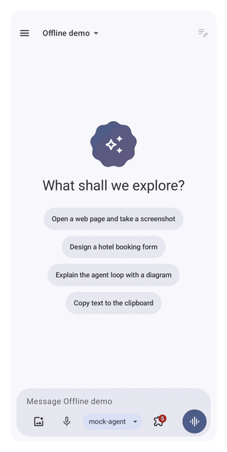

<div align="center">


# AI Elements for Kotlin

**Native Compose components for AI conversations and agents.**

[English](README.md) · [简体中文](README.zh-CN.md)

[](https://github.com/JuneLeGency/ai-elements-kotlin/actions/workflows/ci.yml)
[](https://central.sonatype.com/artifact/io.github.junelegency/ai-elements-bom)
[](LICENSE)


[Documentation](https://junelegency.github.io/ai-elements-kotlin/) ·
[Components](https://junelegency.github.io/ai-elements-kotlin/components/) ·
[Quick start](https://junelegency.github.io/ai-elements-kotlin/getting-started/pure-client/) ·
[API reference](https://junelegency.github.io/ai-elements-kotlin/api/)


</div>

Build a complete chat screen or use just the elements you need. Streaming Markdown, reasoning,
tool approvals, sub-agents, plans, attachments and generated interfaces share one chat model.
Connect your own backend, or run the agent loop inside the app.

Screenshots are rendered from real Android components on an emulator with curated example data.
The [catalog](https://junelegency.github.io/ai-elements-kotlin/components/) includes **65 illustrated scenarios**, compiled examples and API links.
This is the Compose counterpart of [Vercel AI Elements](https://elements.ai-sdk.dev), on public protocols.


## Watch a complete run

Prompt → plan and reasoning → tool approval → on-device execution → streamed reply. Recorded from the real Android app with a deterministic offline demo agent; no model key is needed.

<p align="center">

</p>

## Start with a screen

```kotlin
AiElementsTheme {
    Chat(rememberChat { approver ->
        AgUiBackend("https://agents.example.com/api/agui", approver = approver)
    })
}
```

Follow the [quick start](https://junelegency.github.io/ai-elements-kotlin/getting-started/pure-client/) for imports, Android permissions,
a runnable reference server and ViewModel ownership. The reference server's scripted model needs no API key.

## Choose where the agent runs

| Mode | Your app adds | Start here |
|---|---|---|
| Server agent | UI + an AI SDK, AG-UI, A2A or ACP backend | [Pure client](https://junelegency.github.io/ai-elements-kotlin/getting-started/pure-client/) |
| In-app agent | UI + a model API and optional harness capabilities | [In-app agent](https://junelegency.github.io/ai-elements-kotlin/getting-started/in-app-agent/) |
| Your own implementation | Individual elements, or a custom ChatBackend | [Custom backend](https://junelegency.github.io/ai-elements-kotlin/guides/custom-backend/) |

The UI depends only on `ai-elements-chat`, not the networking modules. Customize the theme, tool/data
renderers and attachment loading without forking the components.

## Install

```kotlin
dependencies {
    implementation(platform("io.github.junelegency:ai-elements-bom:0.3.0"))
    implementation("io.github.junelegency:ai-elements-ui")
    implementation("io.github.junelegency:ai-elements-core")
}
```

Add `google()` and `mavenCentral()` to your dependency repositories.
See [Installation](https://junelegency.github.io/ai-elements-kotlin/getting-started/installation/) for all artifacts, minSdk, desugaring and the
exact tested toolchain. Compose and Material 3 Expressive currently include alpha dependencies.
Stable public APIs are preserved from the first public release, including 0.x; see the
[compatibility policy](https://junelegency.github.io/ai-elements-kotlin/develop/api-compatibility/).

## Explore the elements

| Tools and approvals | Native generated UI | Developer tools |
|:---:|:---:|:---:|
|  |  |  |
| [Tools](https://junelegency.github.io/ai-elements-kotlin/components/tools/) | [Generative UI](https://junelegency.github.io/ai-elements-kotlin/components/generative-ui/) | [Developer tools](https://junelegency.github.io/ai-elements-kotlin/components/developer-tools/) |

Also included: [conversation controls](https://junelegency.github.io/ai-elements-kotlin/components/conversation/), [Markdown and diagrams](https://junelegency.github.io/ai-elements-kotlin/components/content/),
[media](https://junelegency.github.io/ai-elements-kotlin/components/attachments-and-media/), [voice](https://junelegency.github.io/ai-elements-kotlin/components/voice/) and [workflow canvas](https://junelegency.github.io/ai-elements-kotlin/components/workflow/).

Protocols: AI SDK v5/v6 + v4 compatibility · AG-UI 1.x · MCP · MCP Apps · A2A · ACP · A2UI · Agent Skills.
Optional capabilities include files, planning, memory, shell/sandbox, browser, device integration,
speech and scheduled tasks. [Compare backends](https://junelegency.github.io/ai-elements-kotlin/getting-started/choose/).

## Run and verify

```bash
./gradlew :demo:installDebug
./gradlew apiCheck testDebugUnitTest lintDebug
tools/check-published-consumer.sh
tools/build-docs.sh
```

The same repository contains the library, demo, samples and bilingual GitHub Pages site.
See [Testing](https://junelegency.github.io/ai-elements-kotlin/develop/testing/), [Contributing](CONTRIBUTING.md), [Releasing](https://junelegency.github.io/ai-elements-kotlin/develop/releasing/),
[CHANGELOG](CHANGELOG.md) and [Roadmap](https://junelegency.github.io/ai-elements-kotlin/project/roadmap/).

## License and security

Apache-2.0; see [LICENSE](LICENSE) and [NOTICE](NOTICE). `harness-sandbox-proot` packages PRoot
(GPL-2.0) as a separate executable with its own [NOTICE](harness/harness-sandbox-proot/NOTICE).
Report vulnerabilities as described in [SECURITY.md](SECURITY.md).
