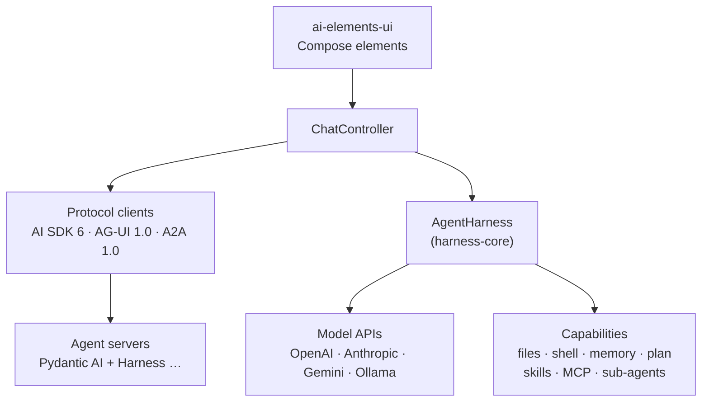

# AI Elements for Kotlin

**Material 3 Expressive** Jetpack Compose components and agent tooling for AI apps on Android —
the Compose counterpart of [Vercel AI Elements](https://elements.ai-sdk.dev), built on open protocols
only: AI SDK, AG-UI, MCP, A2A and Agent Skills.

Use it two ways, with the same UI:

| Mode | Where the agent runs | You add |
|---|---|---|
| **Pure client** (like the Codex or Claude apps) | On your server — Pydantic AI, LangGraph, Mastra, any AI SDK / AG-UI server — or a remote A2A agent | `ai-elements-ui` |
| **In-app agent** | On the device, over any model API | `ai-elements-ui` + `harness-*` capabilities: files, a Linux sandbox, memory, planning, a browser, device tools, speech, scheduled tasks, sub-agents, skills, MCP |



## Highlights

- **Complete element set**: conversation, messages, reasoning, tools with approval, **sub-agents**,
  sources and citations, branches, checkpoints, queue, plan / task / chain of thought, artifacts,
  web preview, workflow canvas, voice, and developer tools (terminal, stack trace, tests, files…).
- **Rich answers**: GitHub-flavoured Markdown, syntax highlighting, **Mermaid** and **KaTeX** (bundled, offline).
- **Open protocols**, current revisions with documented fallbacks: AI SDK 6 UI Message Stream
  (tool approval, client tools, sub-agent output), AG-UI 1.0 (frontend tools, interrupts, sub-agents,
  shared state), MCP 2026-07-28 (with legacy sessions), A2A 1.0 (0.3 compatible), Agent Skills.
- **In-app harness with the Pydantic AI Harness contracts**: the same tool names and behaviour as
  the server library, so on-device and server agents render identically — plus an **Alpine Linux
  sandbox** where the agent can `apk add python3` and run code.
- **Adaptive and accessible**: phones, foldables, tablets; dark mode, dynamic color, 7 palettes ×
  3 contrast levels, fonts and text size, TalkBack; English, 简体中文, 繁體中文, 日本語.

## Install

```kotlin
dependencies {
    implementation(platform("io.github.junelegency:ai-elements-bom:0.3.0-SNAPSHOT"))
    implementation("io.github.junelegency:ai-elements-ui")          // elements (protocol-independent)
    implementation("io.github.junelegency:ai-elements-core")        // AI SDK / AG-UI / model-API backends, agent loop, MCP
    // Optional, as needed:
    implementation("io.github.junelegency:ai-elements-genui")       // generative UI: A2UI surfaces, JsxPreview
    implementation("io.github.junelegency:ai-elements-mcp-apps")    // MCP Apps: interactive views of MCP tools
    implementation("io.github.junelegency:ai-elements-a2a")         // A2A agents (official a2a-java-sdk)
    implementation("io.github.junelegency:ai-elements-koog")        // JetBrains Koog as the agent runtime
    implementation("io.github.junelegency.harness:harness-core")    // in-app agent
    implementation("io.github.junelegency.harness:harness-filesystem")
    implementation("io.github.junelegency.harness:harness-memory")
    implementation("io.github.junelegency.harness:harness-planning")
    implementation("io.github.junelegency.harness:harness-sandbox-proot") // + harness-shell
}
```

| Artifact | What it is | minSdk |
|---|---|---|
| `ai-elements-chat` | The protocol-independent layer: chat model (≈ AI SDK `UIMessage`), `ChatEvent`, `ChatBackend`, `ChatController` (≈ `useChat`). No networking, no Compose. | 24 |
| `ai-elements-core` | Protocol clients (AI SDK, AG-UI), model APIs, agent loop, `SubAgents`, `Skills`, MCP, OAuth — each a `ChatBackend` or capability on top of `ai-elements-chat`. No Compose. | 24 |
| `ai-elements-ui` | The Compose elements and `AiElementsTheme`; depends on `ai-elements-chat` only, so it renders any backend — including your own `ChatBackend`. | 24 |
| `ai-elements-genui` | Generative UI on the elements: A2UI v1.0 surfaces rendered natively (Basic Catalog, extensible with your own components), `JsxPreview`. Depends on `ai-elements-ui` only; transports hand it A2UI messages. | 26 |
| `ai-elements-mcp-apps` | An MCP Apps host (2026-01-26): `ui://` views of MCP tools in a sandboxed WebView (CSP from the view's metadata, no JavaScript interface), bridged to their server; tool approvals, full screen, model context. | 24 |
| `ai-elements-a2a` | A2A 1.0 on the official Java SDK: remote agents as providers or sub-agents. Needs core library desugaring. | 26 |
| `ai-elements-koog` | A JetBrains Koog agent as a `ChatBackend` or harness model binding (`KoogBackend`); AI Elements tools as Koog tools. | 26 |
| `ai-elements-mermaid-native` | Mermaid drawn with Compose Canvas instead of a WebView (experimental). | 24 |
| `ai-elements-bom` | Aligns the versions of everything here. | — |
| `harness-core` | `AgentHarness`: a model + capabilities → a `ChatBackend`; local and remote sub-agents. | 24 |
| `harness-filesystem` | `read_file`, `write_file`, `edit_file`, `list_directory`, `search_files`, `find_files`, `create_directory`, `file_info` — in the workspace and in folders the user shares (`SharedFolders`, mounted at `/mnt/<name>`). | 26 |
| `harness-memory` | `write_memory`, `read_memory`, `delete_memory`, `search_memory`; `MEMORY.md` injected each turn. | 26 |
| `harness-planning` | `write_plan`, `read_plan`, `add_task`, `update_task_status(es)`, `remove_task`; drives the `Plan` element. | 26 |
| `harness-shell` | `run_command`, `start_command`, `check_command`, `stop_command` over a pluggable runtime. | 26 |
| `harness-sandbox-proot` | Alpine Linux via PRoot (bundled executable, GPL-2.0 — see its NOTICE). | 26 |
| `harness-browser` | `navigate`, `snapshot`, `click`, `type_text`, `get_text`, … on an off-screen WebView. | 26 |
| `harness-device` | Device info, clipboard, calendar, contacts, location, alarms, notifications (asks for permissions). | 26 |
| `harness-speech` | `speak`, `stop_speaking` on the platform text-to-speech engine. | 26 |
| `harness-scheduler` | `schedule_task`, `list_scheduled_tasks`, `cancel_scheduled_task`: background runs on WorkManager; implement `ScheduledAgentHost` on your `Application`. | 26 |

R8 rules ship with the libraries.

## Quick start: pure client

The shortest version — one composable wires the conversation, tools, approvals, sub-agents,
plans and the prompt input to a controller (`samples/` has both modes as complete apps):

```kotlin
AiElementsTheme {
    Chat(rememberChat { approver -> AgUiBackend("https://agents.example.com/api/agui", approver = approver) })
}
```

In an app, keep the controller in a `ViewModel` so the conversation survives rotation, and
compose the pieces yourself when you need more control:

```kotlin
class ChatViewModel : ViewModel() {
    // An AG-UI agent (Pydantic AI, LangGraph, CrewAI, Mastra…). Tools that need approval pause
    // the run as an AG-UI interrupt; the UI shows a Confirmation and resumes it.
    val chat = ChatController(backend = { approver ->
        AgUiBackend("https://agents.example.com/api/agui", approver = approver)
        // or UiMessageStreamBackend("…/api/chat", approver = approver)   // AI SDK 5/6
        // or A2aBackend(A2aAgent("https://agents.example.com"))           // A2A (ai-elements-a2a)
    }, scope = viewModelScope)
}

@Composable
fun ChatScreen(vm: ChatViewModel) {
    val state by vm.chat.state.collectAsStateWithLifecycle()
    var input by rememberSaveable { mutableStateOf("") }
    AiElementsTheme {
        Column(Modifier.fillMaxSize().imePadding()) {
            Conversation(
                state = state,
                modifier = Modifier.weight(1f),
                onRegenerate = vm.chat::regenerate,
                onToolApproval = vm.chat::respondToApproval,
                onSelectVersion = vm.chat::selectVersion,
                onRestoreCheckpoint = vm.chat::restoreCheckpoint,
            )
            PromptInput(
                value = input,
                onValueChange = { input = it },
                onSubmit = { if (vm.chat.send(input)) input = "" },
                onStop = vm.chat::stop,
                busy = state.isBusy,
                allowQueue = true,
            )
        }
    }
}
```

Sub-agents, plans, shared state and activities from the server render on their own: a
`delegate_task` call or an AG-UI `SUBAGENT_*` run becomes a `Subagent` card with the nested run.

## Bring your own protocol

Every backend is a `ChatBackend`: a function from the conversation to a stream of `ChatEvent`s.
Map your protocol onto those events and all the elements — streaming Markdown, tools, approvals,
sub-agents, plans — work unchanged (`ai-elements-chat` + `ai-elements-ui` are all you need):

```kotlin
class MyBackend(private val client: MyClient) : ChatBackend {
    override fun stream(history: List<Message>): Flow<ChatEvent> = flow {
        client.run(history.last().text).collect { e ->
            when (e) {
                is MyText -> emit(ChatEvent.TextDelta("answer", e.chunk))
                is MyToolCall -> emit(ChatEvent.ToolInputAvailable(e.id, e.name, e.argsJson, kind = ToolKind.Function))
                is MyToolResult -> emit(ChatEvent.ToolOutput(e.id, e.text))
                is MyHandoff -> emit(ChatEvent.ToolInputAvailable(e.id, "handoff", "{}", kind = ToolKind.Delegation(e.agent, e.task)))
            }
        }
        emit(ChatEvent.Finish)
    }
}
```

## Customising the elements

Elements are protocol-independent: they render `ToolPart.kind` / `source`, data parts and
messages, whichever backend produced them. Replace how any part renders app-wide — without
forking `Conversation` — and plug in your own loading:

```kotlin
CompositionLocalProvider(
    LocalAiElementsRenderers provides AiElementsRenderers(
        tools = mapOf("get_weather" to ToolRenderer { part, _ -> WeatherCard(part.output) }),
        data = mapOf("chart" to DataRenderer { part -> MyChart(part.data) }),   // `data-chart` parts
    ),
    LocalFileLoader provides FileLoader { url -> myHttp.bytes(url) },         // attachment previews
) {
    Chat(controller)
}
```

Bring your brand with `AiElementsTheme(colorScheme = …, typography = …, shapes = …)`; links open
through Compose's `LocalUriHandler`, so provide your own to route them in-app.

On-device tools say what they are (`AgentTool.kindFor` → `ToolKind.Delegation` / `Skill`,
`AgentTool.source` for a provider chip), so custom tools get the same rendering as built-in ones.

## Generative UI

`ai-elements-genui` renders [A2UI](https://a2ui.org) v1.0 surfaces with native Compose components,
whichever protocol carried them — AG-UI `a2ui-surface` activities, A2A `application/a2ui+json`
parts or AI SDK `data-a2ui` parts all arrive as `DataPart.A2UI`. User actions go back on the same
binding (`forwardedProps.a2uiAction`, an A2UI A2A part, a `data-a2ui` part):

```kotlin
LocalAiElementsRenderers provides AiElementsRenderers(
    data = mapOf(DataPart.A2UI to a2uiRenderer { action -> controller.send(action) }),
    codeBlocks = jsxCodeBlocks { action -> controller.send(action) },   // ```jsx fences → JsxPreview
)
```

Add your design system with `A2uiCatalog.Basic.extend(id = "https://example.com/catalog", components = …)`;
`A2uiSurfaceView` / `A2uiState` render a surface outside the chat. `JsxPreview` compiles a JSX subset
onto the same components (bindings only, no code execution) and keeps state while the JSX streams.

## Human in the loop

Every protocol's way of involving the user maps onto one neutral model, so the same elements
answer them all:

| The agent… | AI SDK 6 | AG-UI | MCP | On-device |
|---|---|---|---|---|
| asks to run a tool | `tool-approval-request` | interrupt with a `toolCallId` | — (the host's `McpApproval`) | `requiresApproval` |
| gets a reason or edited arguments back | `approval.reason` | resume `{approved, reason, editedArgs}` | — | reason to the model, edited arguments run |
| asks the user for input | — | interrupt with a `responseSchema` | elicitation (`InputRequiredResult` / `elicitation/create`, form or URL) | via MCP tools |

`Chat` wires it all: `Confirmation` offers approve / deny, deny with a reason and edit-then-approve;
questions show as an `InputRequestCard`, a form built from the request's JSON Schema. With your own
screen, pass `onToolDecision` and `onInputResponse` to `Conversation`, or call
`ChatController.respondToApproval(id, ToolDecision(...))` / `respondToInput(id, InputResponse...)`.

## MCP Apps

MCP tools can ship an interactive view ([MCP Apps](https://github.com/modelcontextprotocol/ext-apps),
`_meta.ui.resourceUri`). With `ai-elements-mcp-apps` the chat shows it under the tool call:

```kotlin
val servers = McpServerStore(context, clientCapabilities = McpApps.CLIENT_CAPABILITIES) // advertise MCP Apps
McpAppsHost({ id -> servers.client(id) }, actions) { apps ->
    CompositionLocalProvider(LocalAiElementsRenderers provides AiElementsRenderers(data = mapOf(DataPart.MCP_APP to apps))) {
        Chat(controller)
    }
}
```

The view runs in a WebView served from its own origin with the Content-Security-Policy its resource
declares, and talks JSON-RPC over a message port. It reaches only its own server's tools whose
`visibility` includes `app`, and tools that are not read-only ask the user first. `ui/message`
becomes a user turn (`McpAppActions.message`); `ui/update-model-context` becomes a
`DataPart.MODEL_CONTEXT` for the next turn, which on-device models read as text and AG-UI sends as
`RunAgentInput.context`. Tools with `visibility: ["app"]` are never given to the model.

## Quick start: in-app agent

```kotlin
val workspace = File(context.filesDir, "workspace")
val harness = AgentHarness(
    model = ProviderProfile("openai", "OpenAI", ProviderKind.OPENAI_RESPONSES, "https://api.openai.com/v1", "gpt-5.5")
        .model(apiKey = key),
    capabilities = {
        listOf(
            FileSystem(workspace),                                  // workspace files
            Shell(AlpineSandbox(context, workspace)),               // Linux sandbox at /workspace
            Memory(FileMemoryStore(File(context.filesDir, "memory"))),
            Planning(),
            Skills.from(SkillLibrary.assets(context.assets, "skills")),
            mcpServers.toolset(),                                   // McpServerStore
        )
    },
    localSubAgents = { listOf(LocalSubAgent("researcher", "Researches a topic", "Be thorough; cite sources.")) },
)
val chat = ChatController(backend = harness::backend, scope = viewModelScope)
```

The sandbox executes PRoot from the native library directory, so the app packages native libraries
extracted: `android { packaging { jniLibs.useLegacyPackaging = true } }`. The Alpine root filesystem
(~4 MB, pinned and checksum-verified) downloads on first use; `AlpineSandbox.state` reports progress.

Tools that change data ask the user first (files, MCP tools unless read-only, the shell outside a sandbox).

## Elements

| Group (package) | Elements |
|---|---|
| Chat (`ui.chat`) | `Conversation` · `MessageItem` · `PromptInput` · `Suggestions` · `Reasoning` · `ToolCall` + `Confirmation` · **`Subagent`** · `Sources` · `InlineCitation` · `ContextUsage` · `BranchSelector` · `Checkpoint` · `Queue` · `OpenInChat` · `ModelSelector` · `Question` · `Agent` (also A2A agent cards) |
| Agent structure (`ui.chat`) | `ChainOfThought` · `Plan` · `Task` · `DataPartView` |
| Workflow (`ui.workflow`) | `WorkflowCanvas` · `agentRunGraph` |
| Content (`ui.markdown`) | `MarkdownContent` · `CodeBlock` · `MermaidDiagram` · `MathBlock` · attachments |
| Voice (`ui.voice`) | `Persona` · `SpeechInput` · `AudioPlayer` · `Transcription` · `MicSelector` · `VoiceSelector` |
| Vibe coding (`ui.code`) | `Artifact` · `WebPreview` · `Terminal` · `StackTrace` · `TestResults` · `FileTree` · `Commit` · `SchemaDisplay` · `PackageInfo` · `EnvironmentVariables` · `Sandbox` · `Snippet` |

All 50 AI Elements are covered except the web-only `JSXPreview`.

## Protocols

| Backend | Spec | Agent loop | Highlights |
|---|---|---|---|
| `UiMessageStreamBackend` | AI SDK 6 UI Message Stream (v5, v4 Data Stream) | server | tool approval, client-side tools, preliminary output, `UIMessage` sub-agents, `data-*` parts |
| `AgUiBackend` | AG-UI 1.0 (official `kotlin-core` types) | server | frontend tools, interrupts / resume, `SUBAGENT_*`, state + JSON Patch, activities, steps, usage |
| `A2aBackend` | A2A 1.0 (0.3 compatible), official `a2a-java-sdk` | remote agent | streaming tasks, artifacts, input-required continuation |
| OpenAI Chat / Responses, Anthropic, Gemini, Ollama | vendor APIs | on-device | tools, reasoning, images, usage, OAuth sign-in |
| `McpClient` / `McpToolset` | MCP 2026-07-28 Streamable HTTP, 2025-xx sessions | — | tools, resources, prompts, progress, OAuth discovery (RFC 9728 / 8414 / 7591 / 8707) |

The rules for adding protocol features — spec extension points only, no private wire formats — are
in [AGENTS.md](AGENTS.md).

## Reference server

`server/` is a Pydantic AI + Pydantic AI Harness agent (Planning, SubAgents, Skills, an MCP toolset
with approval) served over AI SDK 6 (`/api/chat`) and AG-UI 1.0 (`/api/agui`), with an MCP server
(`/mcp`, official `mcp` SDK) and A2A agents (official `a2a-sdk`: a researcher at `/a2a`, and a hotel
concierge at `/concierge/a2a` that answers with A2UI). Its MCP server has an MCP App: `show_notes_board`
opens a notes board built on the official `@modelcontextprotocol/ext-apps` SDK.

```bash
cd server && uv sync
uv run uvicorn main:app --host 0.0.0.0 --port 8788                 # offline scripted model, no key
AGENT_BASE_URL=… AGENT_API_KEY=… AGENT_MODEL=… uv run uvicorn main:app --host 0.0.0.0 --port 8788
```

The scripted model picks a capability by keyword (`delegate`, `plan`, `skill`, `note`, `device`, `hotel` → an A2UI booking form whose
**Book** action comes back as `book`), so
every flow can be exercised without a model; `server/record_fixtures.py` records the client's
protocol fixtures from it. `10.0.2.2` is the emulator's alias for your computer.

## Demo app

`./gradlew :demo:installDebug` — providers and sign-in, conversation history, list–detail on tablets,
MCP servers, skills (bundled from [`/skills`](skills), `.zip` import), sub-agents and remote A2A
agents, the in-app agent's workspace / Linux sandbox / memory / planning, themes, fonts and languages.

## Test

```bash
./gradlew testDebugUnitTest                               # unit + recorded-fixture tests
./gradlew :demo:connectedDebugAndroidTest                 # UI end to end (live cases skip when unreachable)
# Live, opt-in (with the reference server running):
./gradlew :ai-elements-core:testDebugUnitTest --tests '*LiveHarnessServerTest*' -PliveAgentServer=http://localhost:8788
./gradlew :ai-elements-core:testDebugUnitTest --tests '*LiveMcpTest*' -PliveMcp=http://localhost:8788/mcp -PliveMcpLegacy=http://localhost:8790/mcp
./gradlew :ai-elements-core:testDebugUnitTest --tests '*LiveMcpOAuthTest*' -PliveMcpOAuth=http://127.0.0.1:8791/mcp   # after: cd server && uv run python mcp_auth_server.py
./gradlew :ai-elements-a2a:testDebugUnitTest -PliveA2a=http://localhost:8788
./gradlew :dokkaGenerate                                   # API reference → build/dokka/html
./gradlew :ai-elements-core:testDebugUnitTest --tests '*LiveCodexTest*' -PliveCodexAuth=$HOME/.codex/auth.json
```

The live Codex test reads an existing Codex CLI login and never refreshes it (refreshing would sign
the CLI out). On MIUI / HyperOS, instrumentation started in the background needs
`adb shell appops set dev.ai.elements.demo 10021 allow` (reset with `… 10021 default`).

## Contributing

Read [AGENTS.md](AGENTS.md) (open protocols only), [CONTRIBUTING.md](CONTRIBUTING.md), and the
goal and workstreams in [docs/GOAL.md](docs/GOAL.md) and [docs/ROADMAP.md](docs/ROADMAP.md).

## Toolchain

AGP 9.4 (built-in Kotlin) · Gradle 9.7 · Kotlin 2.4 · Compose 1.13 alpha · Material3 1.5 alpha
(Expressive) · adaptive 1.3 · OkHttp 4.12 · kotlinx.serialization · mermaid 12 · KaTeX 0.18.

## License

Apache License 2.0 — see [LICENSE](LICENSE). Bundled third-party code, fonts and executables are
listed in [NOTICE](NOTICE); `harness-sandbox-proot` bundles PRoot (GPL-2.0) as a separate executable,
see its [NOTICE](harness/harness-sandbox-proot/NOTICE).
