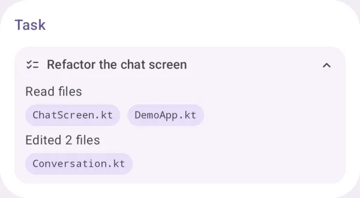
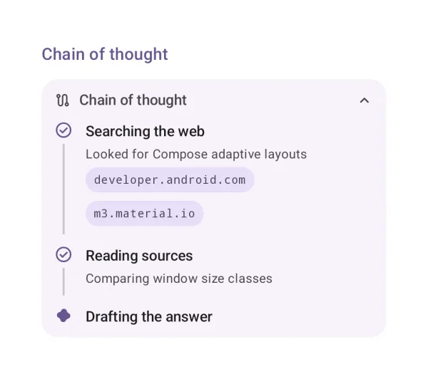
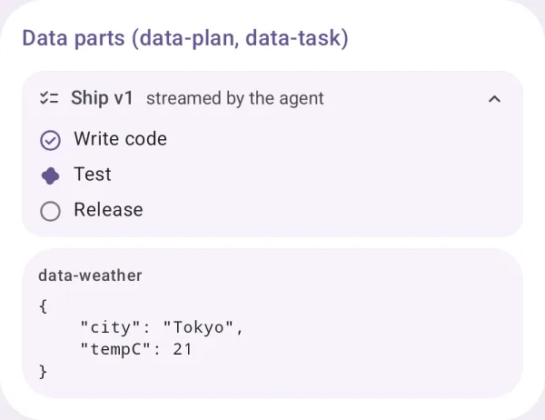

# Agent structure

How the agent works through a request: plans, tasks, chains of thought and data parts.

## Plan

The agent's plan and the step it is on.

{ loading=lazy width="400" }

| | |
|---|---|
| API | `Plan(title, description, steps)` |
| AI Elements | `Plan` |
| Artifact | `ai-elements-ui` |
| Reference | [Plan](../api/ai-elements-ui/dev.ai.elements.ui.chat/-plan.html) |

The caller owns step progress. Use COMPLETE/ACTIVE/PENDING; rendering a plan does not schedule or execute tasks.

```kotlin
import androidx.compose.runtime.Composable
import dev.ai.elements.ui.chat.Plan
import dev.ai.elements.ui.chat.StepStatus
import dev.ai.elements.ui.chat.WorkflowStep
```

```kotlin
--8<-- "demo/src/main/kotlin/dev/ai/elements/demo/samples/DocsSamples.kt:component-plan"
```

## Task

A task and the files it touched.

{ loading=lazy width="400" }

| | |
|---|---|
| API | `Task(title, steps)` |
| AI Elements | `Task` |
| Artifact | `ai-elements-ui` |
| Reference | [Task](../api/ai-elements-ui/dev.ai.elements.ui.chat/-task.html) |

items describe task progress and badges; the component does not change files.

```kotlin
import androidx.compose.runtime.Composable
import dev.ai.elements.ui.chat.Task
import dev.ai.elements.ui.chat.WorkflowStep
```

```kotlin
--8<-- "demo/src/main/kotlin/dev/ai/elements/demo/samples/DocsSamples.kt:component-task"
```

## Chain of thought

The steps of the agent's reasoning, with their sources.

{ loading=lazy width="400" }

| | |
|---|---|
| API | `ChainOfThought(steps)` |
| AI Elements | `ChainOfThought` |
| Artifact | `ai-elements-ui` |
| Reference | [ChainOfThought](../api/ai-elements-ui/dev.ai.elements.ui.chat/-chain-of-thought.html) |

Render available step summaries and sources. This component does not request or reveal reasoning from the model.

```kotlin
import androidx.compose.runtime.Composable
import dev.ai.elements.ui.chat.ChainOfThought
import dev.ai.elements.ui.chat.StepStatus
import dev.ai.elements.ui.chat.WorkflowStep
```

```kotlin
--8<-- "demo/src/main/kotlin/dev/ai/elements/demo/samples/DocsSamples.kt:component-chain-of-thought"
```

## Data parts (data-plan, data-task)

Custom data parts: known names render as elements, others as data.

{ loading=lazy width="400" }

| | |
|---|---|
| API | `DataPartView(part)` |
| Artifact | `ai-elements-ui` |
| Reference | [DataPartView](../api/ai-elements-ui/dev.ai.elements.ui.chat/-data-part-view.html) |

Known plan/task shapes render as elements; custom names can be registered in AiElementsRenderers.data. Unknown data remains visible as structured data.

```kotlin
import androidx.compose.runtime.Composable
import dev.ai.elements.core.model.DataPart
import dev.ai.elements.ui.chat.DataPartView
```

```kotlin
--8<-- "demo/src/main/kotlin/dev/ai/elements/demo/samples/DocsSamples.kt:component-data-parts"
```
