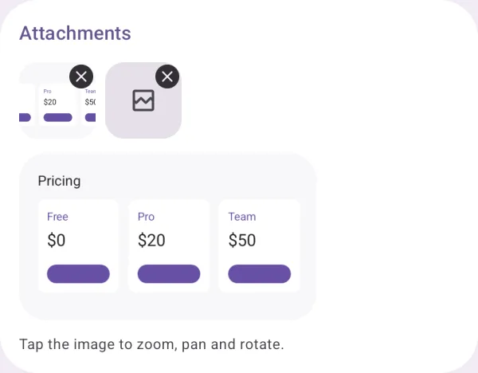
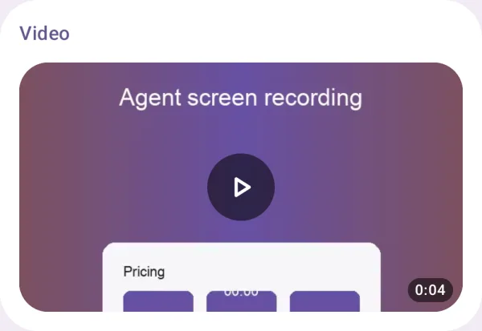
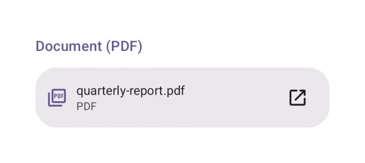
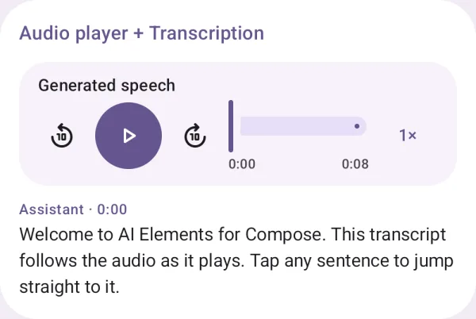

# Attachments and media

Files in a conversation: images, attachments, video, documents and audio.

## Image

An image, upright by EXIF; tap for the viewer (zoom, pan, rotate).

{ loading=lazy width="400" }

| | |
|---|---|
| API | `FileAttachment(file), FileImage(file), ImageViewer(file, onDismiss)` |
| AI Elements | `Image` |

## Attachments

Files attached to a prompt, removable, and images that open full screen.

{ loading=lazy width="400" }

| | |
|---|---|
| API | `AttachmentStrip(attachments, onRemove), FileAttachment(file)` |
| AI Elements | `Attachments` |

## Video

A video's first frame and duration; plays full screen.

{ loading=lazy width="400" }

| | |
|---|---|
| API | `VideoAttachment(file)` |

## Document (PDF)

A PDF's first page and page count; every page in the viewer. Other formats open in an app.

{ loading=lazy width="400" }

| | |
|---|---|
| API | `DocumentAttachment(file)` |

## Audio player + Transcription

Audio with a transcript that follows it and seeks on tap.

{ loading=lazy width="400" }

| | |
|---|---|
| API | `AudioPlayer(state), Transcription(segments, currentTimeMs, onSeek)` |
| AI Elements | `AudioPlayer, Transcription` |
