# Message content

What a reply contains: Markdown, code, math, diagrams, reasoning and sources.

## Markdown

GitHub-flavoured Markdown, rendered as it streams.

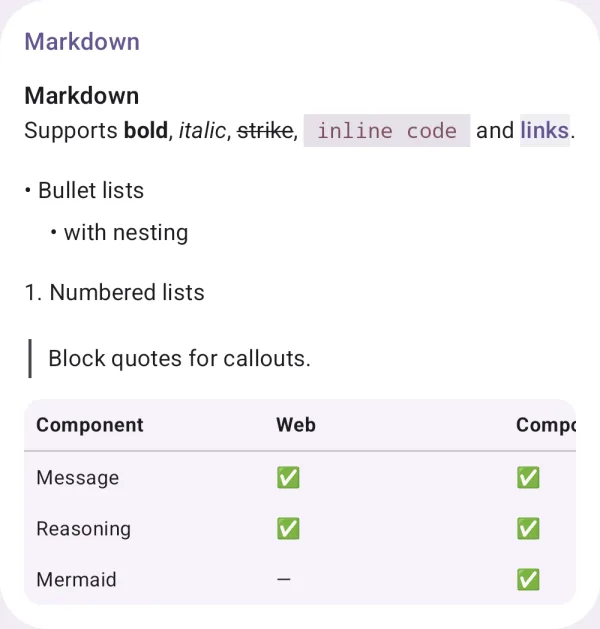{ loading=lazy width="400" }

| | |
|---|---|
| API | `MarkdownContent(markdown)` |
| AI Elements | `Response` |

## Code block

Code with syntax highlighting, a language label and copy.

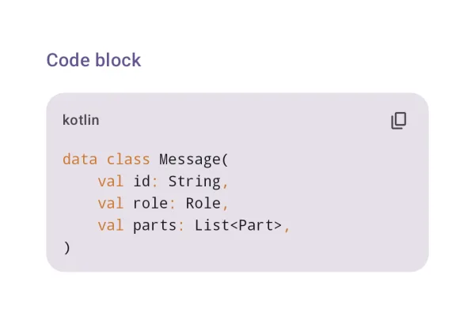{ loading=lazy width="400" }

| | |
|---|---|
| API | `CodeBlock(code, language)` |
| AI Elements | `CodeBlock` |

## Math (KaTeX)

Inline and display math, offline.

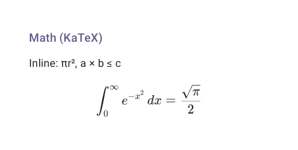{ loading=lazy width="400" }

| | |
|---|---|
| API | `MarkdownContent("$…$")` |

## Mermaid · flowchart

Mermaid diagrams, bundled and offline: a flowchart.

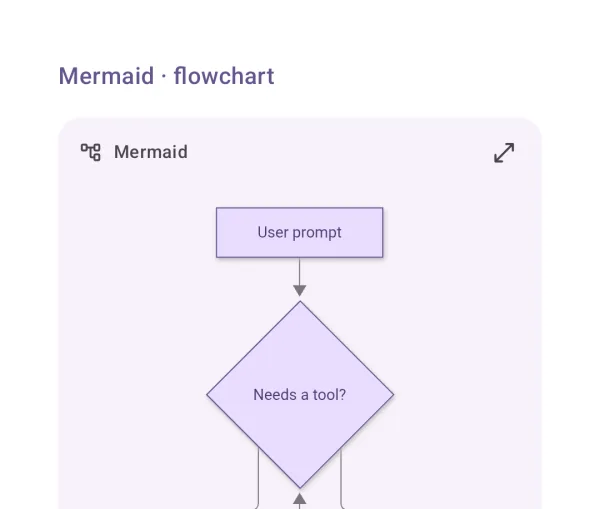{ loading=lazy width="400" }

| | |
|---|---|
| API | `MermaidDiagram(source)` |

## Mermaid · sequence

A sequence diagram.

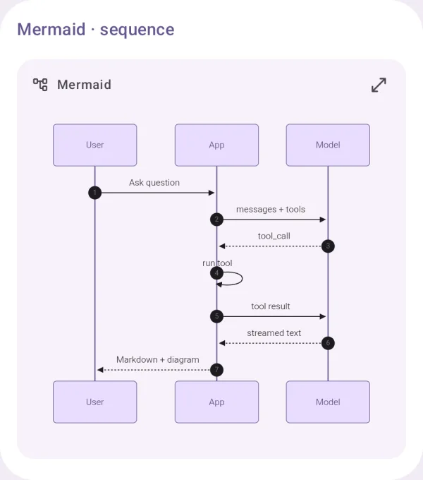{ loading=lazy width="400" }

| | |
|---|---|
| API | `MermaidDiagram(source)` |

## Mermaid · class

A class diagram.

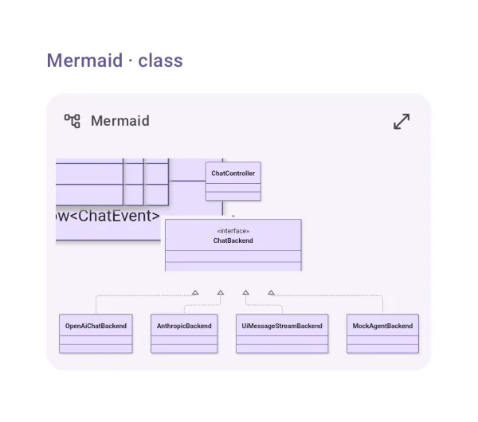{ loading=lazy width="400" }

| | |
|---|---|
| API | `MermaidDiagram(source)` |

## Mermaid · pie

A pie chart.

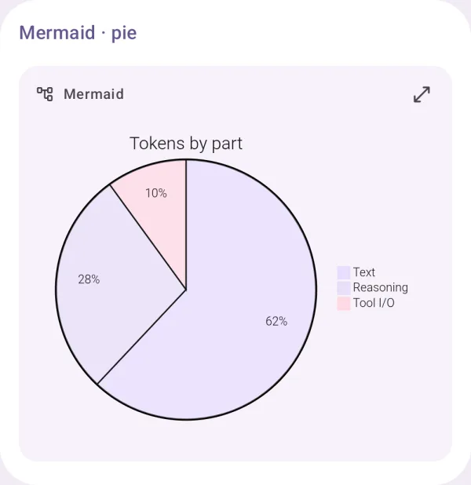{ loading=lazy width="400" }

| | |
|---|---|
| API | `MermaidDiagram(source)` |

## Mermaid · streaming

A diagram still streaming: the source, until it is complete.

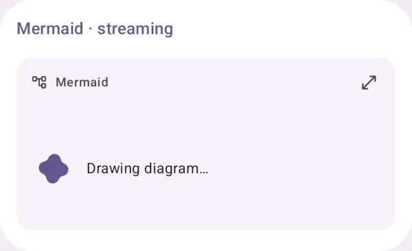{ loading=lazy width="400" }

| | |
|---|---|
| API | `MermaidDiagram(source, complete = false)` |

## Reasoning

The model's thinking: one quiet line that expands.

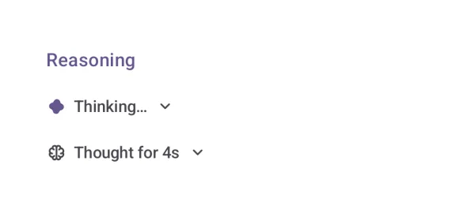{ loading=lazy width="400" }

| | |
|---|---|
| API | `Reasoning(part)` |
| AI Elements | `Reasoning` |

## Sources

The sources a reply used.

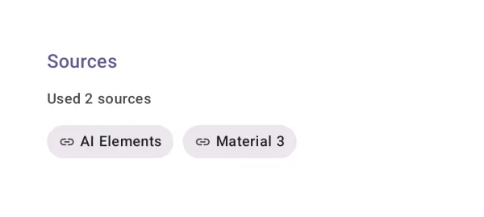{ loading=lazy width="400" }

| | |
|---|---|
| API | `Sources(sources)` |
| AI Elements | `Sources` |

## Inline citation

[n] markers in the text, linked to their sources.

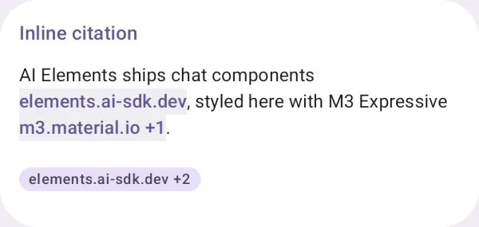{ loading=lazy width="400" }

| | |
|---|---|
| API | `MarkdownContent(text, citations), InlineCitation(sources)` |
| AI Elements | `InlineCitation` |
