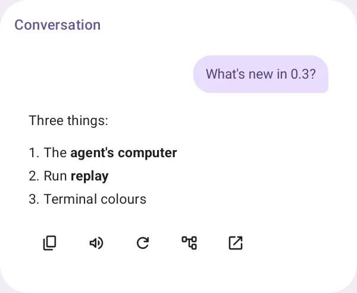
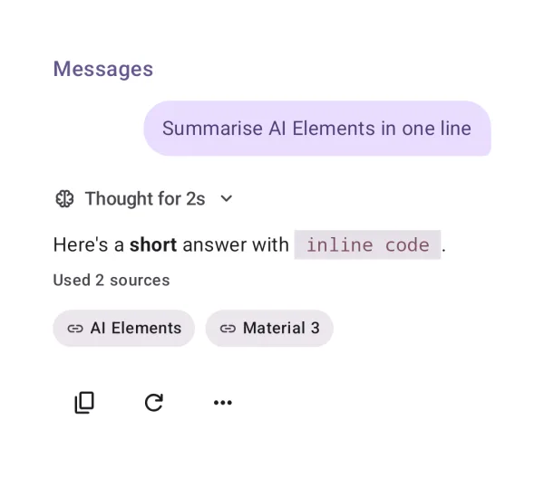
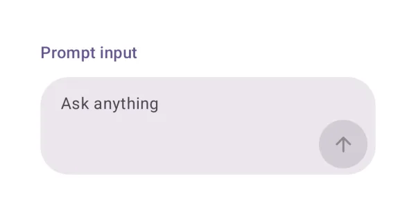
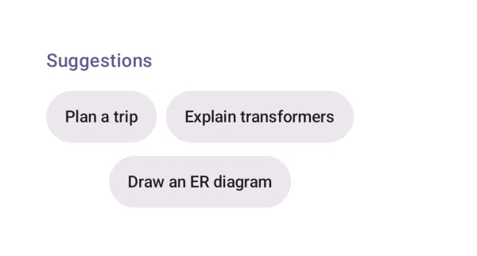
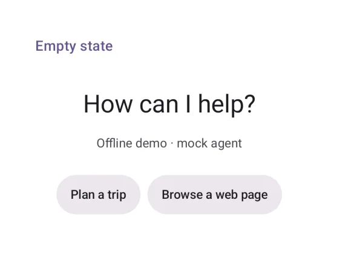
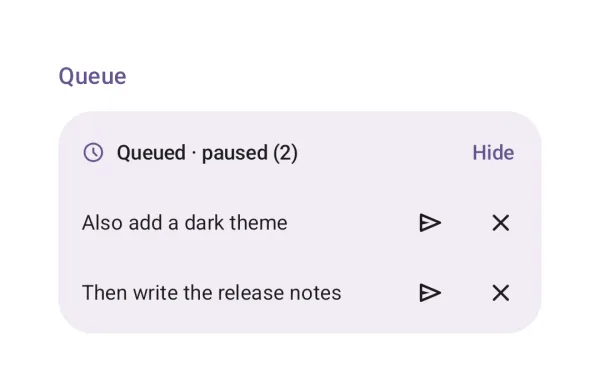
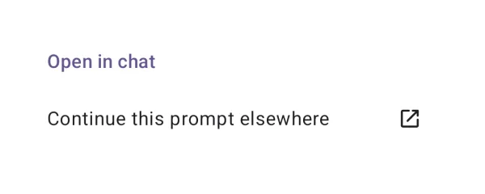
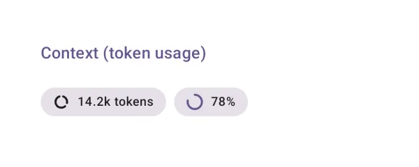

# Conversation

The chat itself: the message list, messages, the composer and what surrounds them.

## Conversation

The scrolling message list: follows the stream, stops when you scroll up, jumps back to the latest.

{ loading=lazy width="400" }

| | |
|---|---|
| API | `Conversation(state, onRegenerate, onToolApproval, …)` |
| AI Elements | `Conversation` |
| Artifact | `ai-elements-ui` |
| Reference | [Conversation](../api/ai-elements-ui/dev.ai.elements.ui.chat/-conversation.html) |

Keep the controller in a ViewModel. Conversation only renders the list; add PromptInput yourself or use Chat. Forward both approvals and forms.

```kotlin
import androidx.compose.runtime.Composable
import androidx.compose.runtime.getValue
import androidx.compose.runtime.setValue
import androidx.lifecycle.compose.collectAsStateWithLifecycle
import dev.ai.elements.core.chat.ChatController
import dev.ai.elements.ui.chat.Conversation
```

```kotlin
--8<-- "demo/src/main/kotlin/dev/ai/elements/demo/samples/DocsSamples.kt:component-conversation"
```

## Messages

A user or assistant message with its parts and actions (copy, read aloud, regenerate, …).

{ loading=lazy width="400" }

| | |
|---|---|
| API | `MessageItem(message, onRegenerate)` |
| AI Elements | `Message` |
| Artifact | `ai-elements-ui` |
| Reference | [MessageItem](../api/ai-elements-ui/dev.ai.elements.ui.chat/-message-item.html) |

Use for one message or a non-lazy layout. For long histories use Conversation, which virtualizes reply blocks.

```kotlin
import androidx.compose.runtime.Composable
import dev.ai.elements.core.chat.ChatController
import dev.ai.elements.core.model.Message
import dev.ai.elements.ui.chat.MessageItem
```

```kotlin
--8<-- "demo/src/main/kotlin/dev/ai/elements/demo/samples/DocsSamples.kt:component-messages"
```

## Prompt input

The composer: text, attachments, dictation, send and stop, queueing while the agent works.

{ loading=lazy width="400" }

| | |
|---|---|
| API | `PromptInput(value, onValueChange, onSubmit, onStop, busy)` |
| AI Elements | `PromptInput` |
| Artifact | `ai-elements-ui` |
| Reference | [PromptInput](../api/ai-elements-ui/dev.ai.elements.ui.chat/-prompt-input.html) |

The caller owns text and attachments. Clear text only after send accepts it. Set allowQueue when the controller can queue prompts.

```kotlin
import androidx.compose.runtime.Composable
import androidx.compose.runtime.getValue
import androidx.compose.runtime.mutableStateOf
import androidx.compose.runtime.saveable.rememberSaveable
import androidx.compose.runtime.setValue
import androidx.lifecycle.compose.collectAsStateWithLifecycle
import dev.ai.elements.core.chat.ChatController
import dev.ai.elements.ui.chat.PromptInput
```

```kotlin
--8<-- "demo/src/main/kotlin/dev/ai/elements/demo/samples/DocsSamples.kt:component-prompt-input"
```

## Suggestions

Tappable prompt suggestions.

{ loading=lazy width="400" }

| | |
|---|---|
| API | `Suggestions(suggestions, onSelect)` |
| AI Elements | `Suggestion` |
| Artifact | `ai-elements-ui` |
| Reference | [Suggestions](../api/ai-elements-ui/dev.ai.elements.ui.chat/-suggestions.html) |

Selecting a suggestion only invokes onSelect; the caller decides whether to fill the composer or send immediately.

```kotlin
import androidx.compose.runtime.Composable
import dev.ai.elements.core.chat.ChatController
import dev.ai.elements.core.model.Suggestion
import dev.ai.elements.ui.chat.Suggestions
```

```kotlin
--8<-- "demo/src/main/kotlin/dev/ai/elements/demo/samples/DocsSamples.kt:component-suggestions"
```

## Empty state

The start of a conversation: a greeting and suggestions.

{ loading=lazy width="400" }

| | |
|---|---|
| API | `ChatEmptyState(title, subtitle, suggestions, onSelect)` |
| Artifact | `ai-elements-ui` |
| Reference | [ChatEmptyState](../api/ai-elements-ui/dev.ai.elements.ui.chat/-chat-empty-state.html) |

Show while history is empty. Set showHero=false in a short container.

```kotlin
import androidx.compose.runtime.Composable
import dev.ai.elements.core.chat.ChatController
import dev.ai.elements.core.model.Suggestion
import dev.ai.elements.ui.chat.ChatEmptyState
```

```kotlin
--8<-- "demo/src/main/kotlin/dev/ai/elements/demo/samples/DocsSamples.kt:component-empty-state"
```

## Branch

Switch between regenerated versions of a reply.

{ loading=lazy width="400" }

| | |
|---|---|
| API | `BranchSelector(index, count, onSelect)` |
| AI Elements | `Branch` |
| Artifact | `ai-elements-ui` |
| Reference | [BranchSelector](../api/ai-elements-ui/dev.ai.elements.ui.chat/-branch-selector.html) |

index is zero-based. The app must update the selected message; this control does not edit history.

```kotlin
import androidx.compose.runtime.Composable
import dev.ai.elements.core.chat.ChatController
import dev.ai.elements.core.model.Message
import dev.ai.elements.ui.chat.BranchSelector
```

```kotlin
--8<-- "demo/src/main/kotlin/dev/ai/elements/demo/samples/DocsSamples.kt:component-branch"
```

## Checkpoint

Restore the conversation to an earlier point, after confirming.

{ loading=lazy width="400" }

| | |
|---|---|
| API | `Checkpoint(onRestore)` |
| AI Elements | `Checkpoint` |
| Artifact | `ai-elements-ui` |
| Reference | [Checkpoint](../api/ai-elements-ui/dev.ai.elements.ui.chat/-checkpoint.html) |

The element confirms before calling onRestore. Restoring the controller changes conversation history, not files changed by past tools.

```kotlin
import androidx.compose.runtime.Composable
import dev.ai.elements.core.chat.ChatController
import dev.ai.elements.ui.chat.Checkpoint
```

```kotlin
--8<-- "demo/src/main/kotlin/dev/ai/elements/demo/samples/DocsSamples.kt:component-checkpoint"
```

## Queue

Messages waiting to be sent while the agent is busy.

{ loading=lazy width="400" }

| | |
|---|---|
| API | `Queue(items, paused, onRemove, onSendNow)` |
| AI Elements | `Queue` |
| Artifact | `ai-elements-ui` |
| Reference | [Queue](../api/ai-elements-ui/dev.ai.elements.ui.chat/-queue.html) |

The controller owns queue order. Stop or error pauses automatic sending; wire Send now to resume explicitly.

```kotlin
import androidx.compose.runtime.Composable
import androidx.compose.runtime.getValue
import androidx.compose.runtime.setValue
import androidx.lifecycle.compose.collectAsStateWithLifecycle
import dev.ai.elements.core.chat.ChatController
import dev.ai.elements.ui.chat.Queue
```

```kotlin
--8<-- "demo/src/main/kotlin/dev/ai/elements/demo/samples/DocsSamples.kt:component-queue"
```

## Open in chat

Continue a prompt in another chat app.

{ loading=lazy width="400" }

| | |
|---|---|
| API | `OpenInChat(prompt)` |
| AI Elements | `OpenInChat` |
| Artifact | `ai-elements-ui` |
| Reference | [OpenInChat](../api/ai-elements-ui/dev.ai.elements.ui.chat/-open-in-chat.html) |

Opens the chosen external chat with the prompt in its URL. Let the user choose; do not pass hidden context or credentials.

```kotlin
import androidx.compose.runtime.Composable
import dev.ai.elements.ui.chat.OpenInChat
```

```kotlin
--8<-- "demo/src/main/kotlin/dev/ai/elements/demo/samples/DocsSamples.kt:component-open-in-chat"
```

## Model selector

Pick a model, with its provider, capabilities and context window.

{ loading=lazy width="400" }

| | |
|---|---|
| API | `ModelSelector(models, selectedId, onSelect)` |
| AI Elements | `ModelSelector` |
| Artifact | `ai-elements-ui` |
| Reference | [ModelSelector](../api/ai-elements-ui/dev.ai.elements.ui.chat/-model-selector.html) |

The selection is UI state only. Your backend factory must read it on the next turn; preserve the current controller/history.

```kotlin
import androidx.compose.runtime.Composable
import androidx.compose.runtime.getValue
import androidx.compose.runtime.mutableStateOf
import androidx.compose.runtime.saveable.rememberSaveable
import androidx.compose.runtime.setValue
import dev.ai.elements.ui.chat.ModelOption
import dev.ai.elements.ui.chat.ModelSelector
```

```kotlin
--8<-- "demo/src/main/kotlin/dev/ai/elements/demo/samples/DocsSamples.kt:component-model-selector"
```

## Context (token usage)

Tokens used by the conversation, against the model's context window.

{ loading=lazy width="400" }

| | |
|---|---|
| API | `ContextUsage(usage, contextWindow)` |
| AI Elements | `Context` |
| Artifact | `ai-elements-ui` |
| Reference | [ContextUsage](../api/ai-elements-ui/dev.ai.elements.ui.chat/-context-usage.html) |

Pass measured token usage and the chosen model limit. This indicator does not tokenize messages or truncate history.

```kotlin
import androidx.compose.runtime.Composable
import dev.ai.elements.core.model.Usage
import dev.ai.elements.ui.chat.ContextUsage
```

```kotlin
--8<-- "demo/src/main/kotlin/dev/ai/elements/demo/samples/DocsSamples.kt:component-context"
```

## Loading indicators

Material 3 Expressive loading indicators while a reply starts.

{ loading=lazy width="400" }

| | |
|---|---|
| API | `LoadingIndicator(), ContainedLoadingIndicator()` |
| AI Elements | `Loader` |
| Artifact | `ai-elements-ui` |
| Reference | [LoadingIndicator](https://developer.android.com/reference/kotlin/androidx/compose/material3/package-summary) |

These are Material 3 components, exposed by the Material dependency. Use while waiting for initial output; opt in to ExperimentalMaterial3ExpressiveApi.

```kotlin
import androidx.compose.runtime.Composable
```

```kotlin
--8<-- "demo/src/main/kotlin/dev/ai/elements/demo/samples/DocsSamples.kt:component-loading"
```

## Shimmer

Text with a moving highlight, for work in progress.

{ loading=lazy width="400" }

| | |
|---|---|
| API | `ShimmerText(text, active)` |
| AI Elements | `Shimmer` |
| Artifact | `ai-elements-ui` |
| Reference | [ShimmerText](../api/ai-elements-ui/dev.ai.elements.ui.chat/-shimmer-text.html) |

Set active=false when work ends. Prefer a plain status label for long messages.

```kotlin
import androidx.compose.runtime.Composable
import dev.ai.elements.ui.chat.ShimmerText
```

```kotlin
--8<-- "demo/src/main/kotlin/dev/ai/elements/demo/samples/DocsSamples.kt:component-shimmer"
```
