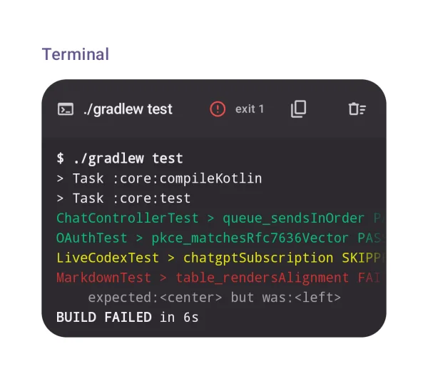
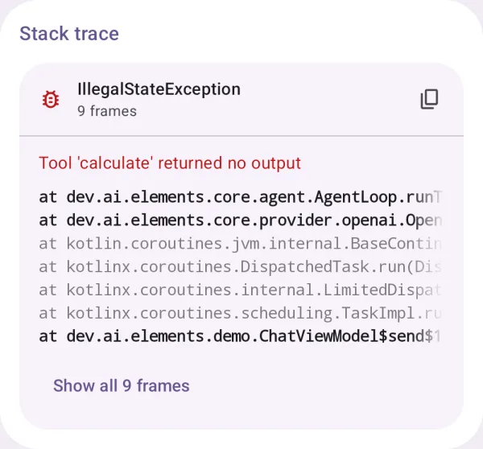
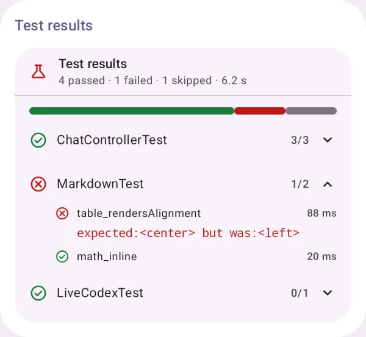
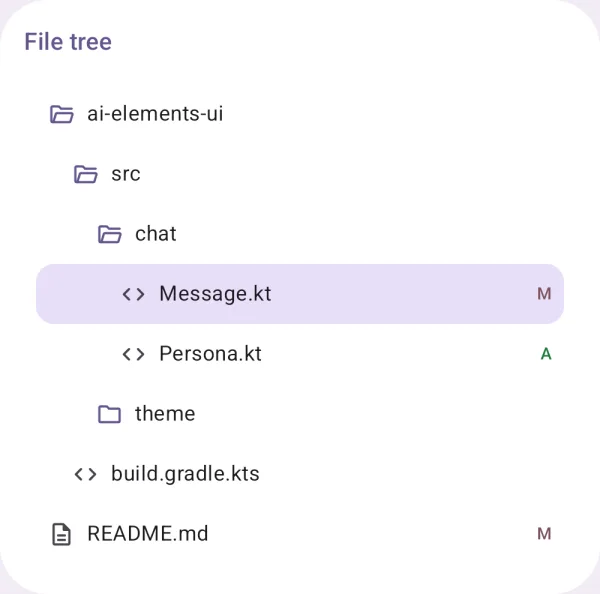
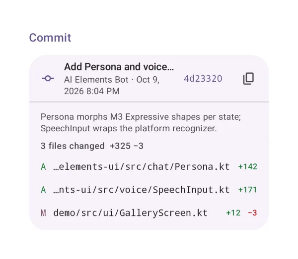
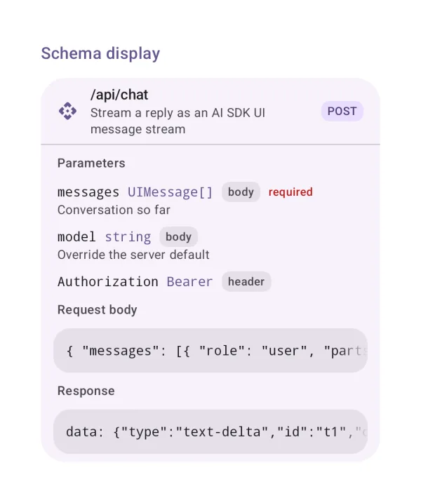
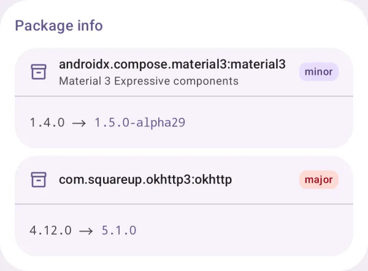
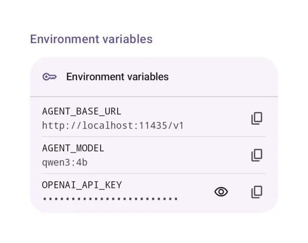
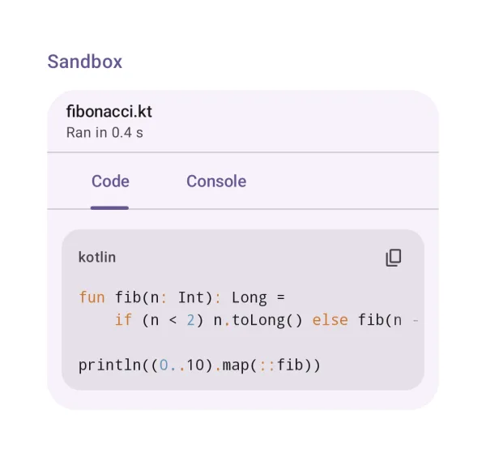
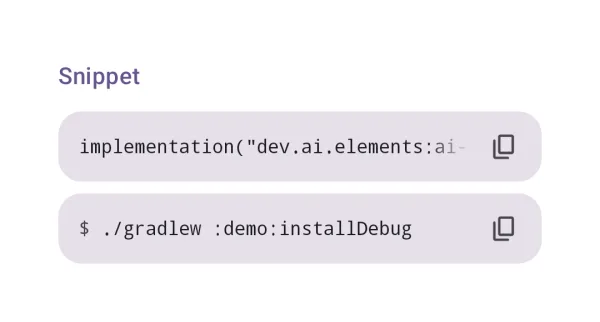

# Developer tools

Elements for coding agents: terminals, stack traces, tests, files, commits and more.

## Terminal

Command output as a terminal shows it: colours, progress bars, links.

{ loading=lazy width="400" }

| | |
|---|---|
| API | `Terminal(output, title, status, exitCode)` |
| AI Elements | `Terminal` |
| Artifact | `ai-elements-ui` |
| Reference | [Terminal](../api/ai-elements-ui/dev.ai.elements.ui.code/-terminal.html) |

Pass accumulated command output. ANSI styling is supported, with bounded scrollback; this is an output view, not an interactive shell.

```kotlin
import androidx.compose.runtime.Composable
import dev.ai.elements.ui.code.Terminal
import dev.ai.elements.ui.code.TerminalStatus
```

```kotlin
--8<-- "demo/src/main/kotlin/dev/ai/elements/demo/samples/DocsSamples.kt:component-terminal"
```

## Stack trace

A stack trace with app frames first and library frames folded.

{ loading=lazy width="400" }

| | |
|---|---|
| API | `StackTrace(trace)` |
| AI Elements | `StackTrace` |
| Artifact | `ai-elements-ui` |
| Reference | [StackTrace](../api/ai-elements-ui/dev.ai.elements.ui.code/-stack-trace.html) |

Takes raw trace text. App frames and dependency frames can be folded; this view does not upload crash reports.

```kotlin
import androidx.compose.runtime.Composable
import dev.ai.elements.ui.code.StackTrace
```

```kotlin
--8<-- "demo/src/main/kotlin/dev/ai/elements/demo/samples/DocsSamples.kt:component-stack-trace"
```

## Test results

Test suites with passed, failed and skipped cases.

{ loading=lazy width="400" }

| | |
|---|---|
| API | `TestResults(suites, durationMs)` |
| AI Elements | `TestResults` |
| Artifact | `ai-elements-ui` |
| Reference | [TestResults](../api/ai-elements-ui/dev.ai.elements.ui.code/-test-results.html) |

Supply actual test results and durations in milliseconds; the component does not run tests.

```kotlin
import androidx.compose.runtime.Composable
import dev.ai.elements.ui.code.TestCaseResult
import dev.ai.elements.ui.code.TestResults
import dev.ai.elements.ui.code.TestStatus
import dev.ai.elements.ui.code.TestSuiteResult
```

```kotlin
--8<-- "demo/src/main/kotlin/dev/ai/elements/demo/samples/DocsSamples.kt:component-test-results"
```

## File tree

A project's files, with change badges.

{ loading=lazy width="400" }

| | |
|---|---|
| API | `FileTree(nodes, expanded, selectedPath, onSelect)` |
| AI Elements | `FileTree` |
| Artifact | `ai-elements-ui` |
| Reference | [FileTree](../api/ai-elements-ui/dev.ai.elements.ui.code/-file-tree.html) |

The caller provides file nodes; selecting a node does not read it. Pass expanded paths when you need initial folder expansion.

```kotlin
import androidx.compose.runtime.Composable
import androidx.compose.runtime.getValue
import androidx.compose.runtime.mutableStateOf
import androidx.compose.runtime.saveable.rememberSaveable
import androidx.compose.runtime.setValue
import dev.ai.elements.ui.code.FileNode
import dev.ai.elements.ui.code.FileTree
```

```kotlin
--8<-- "demo/src/main/kotlin/dev/ai/elements/demo/samples/DocsSamples.kt:component-file-tree"
```

## Commit

A commit with its message and changed files.

{ loading=lazy width="400" }

| | |
|---|---|
| API | `Commit(hash, message, author, timestampMs, files)` |
| AI Elements | `Commit` |
| Artifact | `ai-elements-ui` |
| Reference | [Commit](../api/ai-elements-ui/dev.ai.elements.ui.code/-commit.html) |

Metadata display only. Hash/message/files come from your source control tool; no git operation is performed.

```kotlin
import androidx.compose.runtime.Composable
import dev.ai.elements.ui.code.Commit
import dev.ai.elements.ui.code.CommitFile
import dev.ai.elements.ui.code.FileChange
```

```kotlin
--8<-- "demo/src/main/kotlin/dev/ai/elements/demo/samples/DocsSamples.kt:component-commit"
```

## Schema display

An API endpoint: parameters, request and response.

{ loading=lazy width="400" }

| | |
|---|---|
| API | `SchemaDisplay(method, path, parameters, requestBody, responseBody)` |
| AI Elements | `SchemaDisplay` |
| Artifact | `ai-elements-ui` |
| Reference | [SchemaDisplay](../api/ai-elements-ui/dev.ai.elements.ui.code/-schema-display.html) |

Displays a schema summary; it does not validate or invoke the endpoint. requestBody/responseBody are example text.

```kotlin
import androidx.compose.runtime.Composable
import dev.ai.elements.ui.code.SchemaDisplay
import dev.ai.elements.ui.code.SchemaParameter
```

```kotlin
--8<-- "demo/src/main/kotlin/dev/ai/elements/demo/samples/DocsSamples.kt:component-schema-display"
```

## Package info

A dependency change and its size.

{ loading=lazy width="400" }

| | |
|---|---|
| API | `PackageInfo(name, fromVersion, toVersion, change)` |
| AI Elements | `PackageInfo` |
| Artifact | `ai-elements-ui` |
| Reference | [PackageInfo](../api/ai-elements-ui/dev.ai.elements.ui.code/-package-info.html) |

The app supplies the change classification and size metadata. No dependency resolution or update is performed.

```kotlin
import androidx.compose.runtime.Composable
import dev.ai.elements.ui.code.PackageChange
import dev.ai.elements.ui.code.PackageInfo
```

```kotlin
--8<-- "demo/src/main/kotlin/dev/ai/elements/demo/samples/DocsSamples.kt:component-package-info"
```

## Environment variables

Environment variables with secrets masked until revealed.

{ loading=lazy width="400" }

| | |
|---|---|
| API | `EnvironmentVariables(variables)` |
| AI Elements | `EnvironmentVariables` |
| Artifact | `ai-elements-ui` |
| Reference | [EnvironmentVariables](../api/ai-elements-ui/dev.ai.elements.ui.code/-environment-variables.html) |

Values marked secret are visually masked, not encrypted. Do not put real credentials in examples or screenshots.

```kotlin
import androidx.compose.runtime.Composable
import dev.ai.elements.ui.code.EnvironmentVariable
import dev.ai.elements.ui.code.EnvironmentVariables
```

```kotlin
--8<-- "demo/src/main/kotlin/dev/ai/elements/demo/samples/DocsSamples.kt:component-environment-variables"
```

## Sandbox

Code and its output in tabs.

{ loading=lazy width="400" }

| | |
|---|---|
| API | `Sandbox(title, tabs)` |
| AI Elements | `Sandbox` |
| Artifact | `ai-elements-ui` |
| Reference | [Sandbox](../api/ai-elements-ui/dev.ai.elements.ui.code/-sandbox.html) |

This is a tabbed presentation of code and results. Execution is supplied separately by harness-shell or your backend.

```kotlin
import androidx.compose.material3.Text
import androidx.compose.runtime.Composable
import dev.ai.elements.ui.code.Sandbox
import dev.ai.elements.ui.code.SandboxTab
import dev.ai.elements.ui.markdown.CodeBlock
```

```kotlin
--8<-- "demo/src/main/kotlin/dev/ai/elements/demo/samples/DocsSamples.kt:component-sandbox"
```

## Snippet

A one-line command to copy.

{ loading=lazy width="400" }

| | |
|---|---|
| API | `Snippet(text, prefix)` |
| AI Elements | `Snippet` |
| Artifact | `ai-elements-ui` |
| Reference | [Snippet](../api/ai-elements-ui/dev.ai.elements.ui.code/-snippet.html) |

Displays a copyable command; clicking copy does not execute it.

```kotlin
import androidx.compose.runtime.Composable
import dev.ai.elements.ui.code.Snippet
```

```kotlin
--8<-- "demo/src/main/kotlin/dev/ai/elements/demo/samples/DocsSamples.kt:component-snippet"
```
