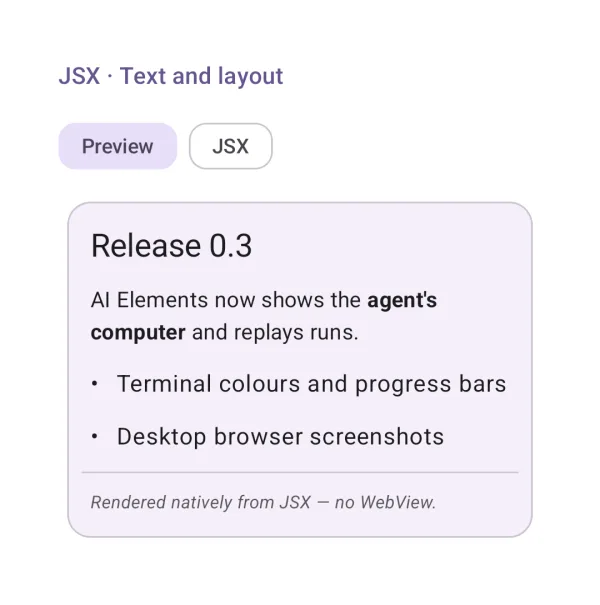
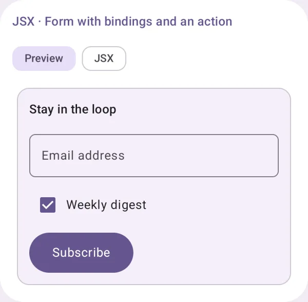
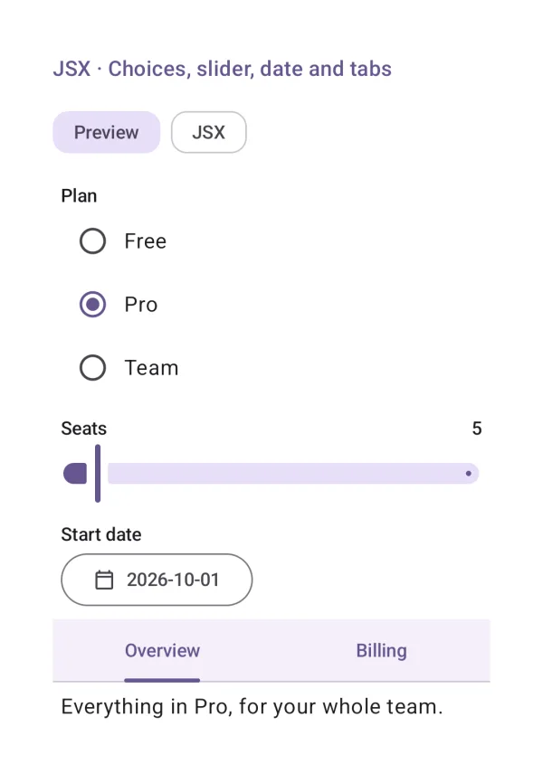
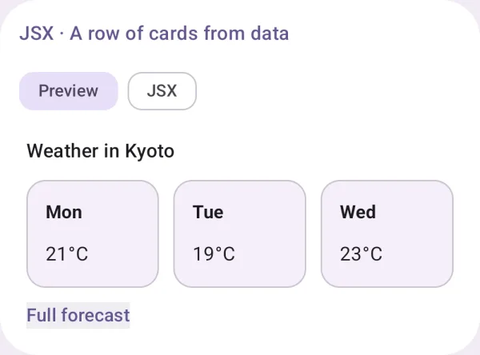
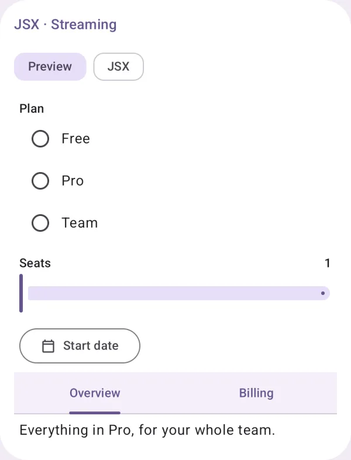
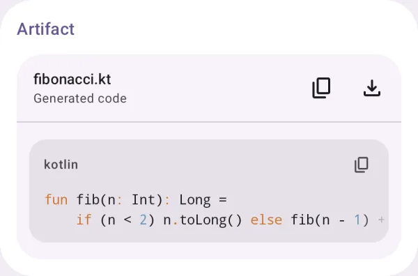
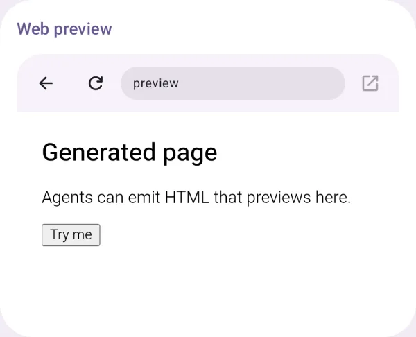

# Generative UI

Answers with interface: JSX and A2UI rendered natively, artifacts and web previews.

## JSX · Text and layout

Model-written JSX rendered natively: headings, text, lists, dividers.

{ loading=lazy width="400" }

| | |
|---|---|
| API | `JsxPreview(jsx), jsxCodeBlocks()` |
| AI Elements | `JSXPreview` |

## JSX · Form with bindings and an action

Inputs bound to the data model; `onClick={subscribe}` sends an action with it.

{ loading=lazy width="400" }

| | |
|---|---|
| API | `JsxPreview(jsx, bindings, onAction)` |
| AI Elements | `JSXPreview` |

## JSX · Choices, slider, date and tabs

`<select>` / `<option>`, `<Slider>`, `<DateTimeInput>` and `<Tabs>` in JSX.

{ loading=lazy width="400" }

| | |
|---|---|
| API | `JsxPreview(jsx, bindings)` |
| AI Elements | `JSXPreview` |

## JSX · A row of cards from data

A layout of cards whose values come from bindings, and a link.

{ loading=lazy width="400" }

| | |
|---|---|
| API | `JsxPreview(jsx, bindings)` |
| AI Elements | `JSXPreview` |

## JSX · Streaming

JSX rendered while it streams in: half-written tags wait, what the user typed stays.

{ loading=lazy width="400" }

| | |
|---|---|
| API | `JsxPreview(partialJsx)` |
| AI Elements | `JSXPreview` |

## A2UI surface

An A2UI v1.0 surface (the reference server's booking form) rendered natively.

{ loading=lazy width="400" }

| | |
|---|---|
| API | `A2uiSurfaceView(surface, onAction), a2uiRenderer()` |

## Artifact

A generated artifact with its actions.

{ loading=lazy width="400" }

| | |
|---|---|
| API | `Artifact(title, description, actions) { … }` |
| AI Elements | `Artifact` |

## Web preview

A generated page or URL in a sandboxed WebView.

{ loading=lazy width="400" }

| | |
|---|---|
| API | `WebPreview(url, html)` |
| AI Elements | `WebPreview` |
