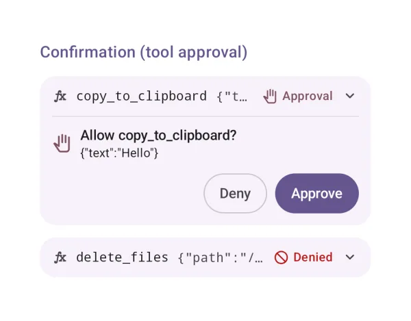
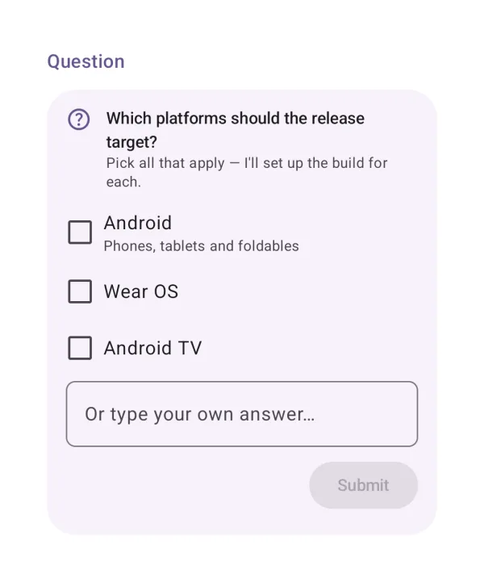
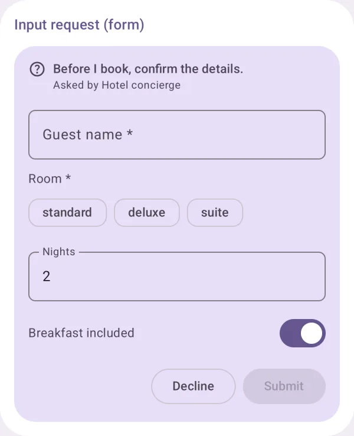

# Human in the loop

Where the agent asks the user: approvals, questions and forms.

## Confirmation (tool approval)

Approve or deny a tool call, with a reason or edited arguments.

{ loading=lazy width="400" }

| | |
|---|---|
| API | `ToolCall(part, onApproval)` |
| AI Elements | `Confirmation` |
| Artifact | `ai-elements-ui` |
| Reference | [ToolCall](../api/ai-elements-ui/dev.ai.elements.ui.chat/-tool-call.html) |

Respect approvalAnswers: only offer reasons/edited input supported by the backend. Approval must resume the waiting tool, not create a new user turn.

```kotlin
import androidx.compose.runtime.Composable
import dev.ai.elements.core.chat.ChatController
import dev.ai.elements.core.model.ToolPart
import dev.ai.elements.core.model.ToolState
import dev.ai.elements.ui.chat.ToolCall
```

```kotlin
--8<-- "demo/src/main/kotlin/dev/ai/elements/demo/samples/DocsSamples.kt:component-confirmation"
```

## Question

A multiple-choice question from the agent.

{ loading=lazy width="400" }

| | |
|---|---|
| API | `Question(prompt, options, multiple, onSubmit)` |
| Artifact | `ai-elements-ui` |
| Reference | [Question](../api/ai-elements-ui/dev.ai.elements.ui.chat/-question.html) |

Store the returned selected ids/text and forward them to your agent. answered prevents resubmitting a completed question.

```kotlin
import androidx.compose.runtime.Composable
import androidx.compose.runtime.getValue
import androidx.compose.runtime.mutableStateOf
import androidx.compose.runtime.remember
import androidx.compose.runtime.setValue
import dev.ai.elements.ui.chat.Question
import dev.ai.elements.ui.chat.QuestionAnswer
import dev.ai.elements.ui.chat.QuestionOption
```

```kotlin
--8<-- "demo/src/main/kotlin/dev/ai/elements/demo/samples/DocsSamples.kt:component-question"
```

## Input request (form)

A form the agent asks the user to fill, from a JSON Schema (AG-UI interrupts, MCP elicitation).

{ loading=lazy width="400" }

| | |
|---|---|
| API | `InputRequestCard(request, onRespond)` |
| Artifact | `ai-elements-ui` |
| Reference | [InputRequestCard](../api/ai-elements-ui/dev.ai.elements.ui.chat/-input-request-card.html) |

Use the exact request id when responding. Forms validate the supported JSON Schema fields; URL requests require the user to complete the external flow.

```kotlin
import androidx.compose.runtime.Composable
import dev.ai.elements.core.chat.ChatController
import dev.ai.elements.core.chat.InputRequest
import dev.ai.elements.ui.chat.InputRequestCard
```

```kotlin
--8<-- "demo/src/main/kotlin/dev/ai/elements/demo/samples/DocsSamples.kt:component-input-request"
```
