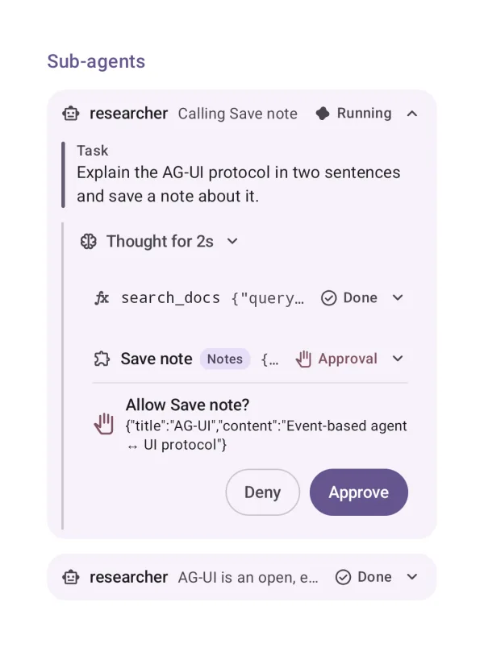
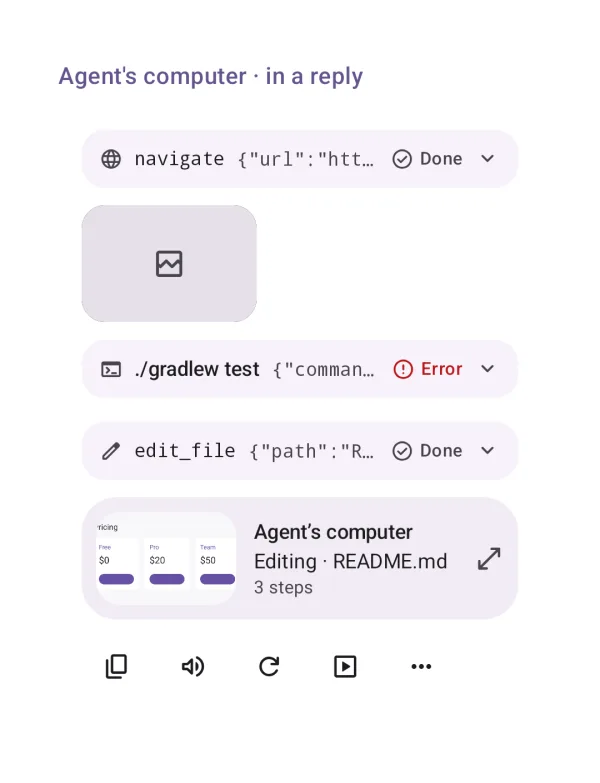
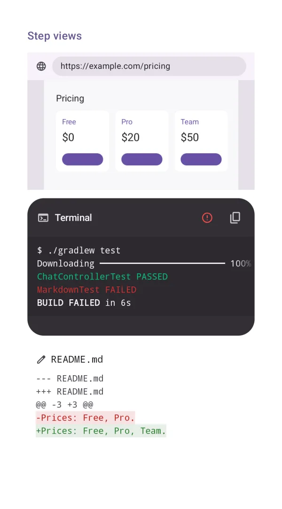
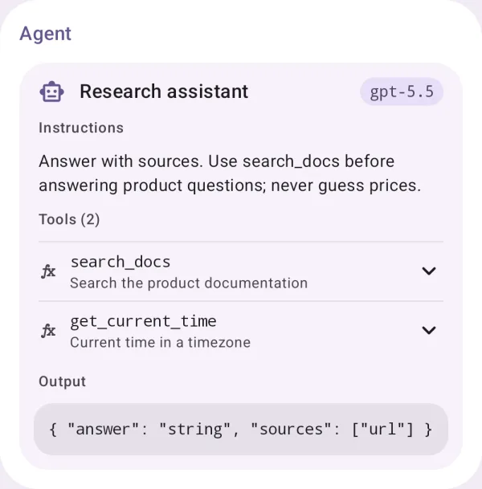

# Tools and the agent's computer

Tool calls, delegated agents, and the agent's computer that shows each step as the agent saw it.

## Tool calls

A tool call with its input, output or error, progress, and what provides it.

{ loading=lazy width="400" }

| | |
|---|---|
| API | `ToolCall(part, onApproval)` |
| AI Elements | `Tool` |

## Sub-agents

A delegated agent's run, nested in the call that started it.

{ loading=lazy width="400" }

| | |
|---|---|
| API | `ToolPartView(part)` |

## Agent's computer

Each step as the agent saw it (screenshot, terminal, diff, file), with a timeline, autoplay, back to live and replay.

{ loading=lazy width="400" }

| | |
|---|---|
| API | `AgentComputerPanel(state, message), AgentComputerScaffold(state, messages, layout)` |

## Agent's computer · in a reply

The live preview card under a reply that works on a computer; it opens the panel.

{ loading=lazy width="400" }

| | |
|---|---|
| API | `Conversation / Chat (automatic)` |

## Step views

A step by its category: a browser frame with the screenshot, a terminal, a diff.

{ loading=lazy width="400" }

| | |
|---|---|
| API | `StepView(step)` |

## Agent

An agent's card: model, instructions, tools and output schema.

{ loading=lazy width="400" }

| | |
|---|---|
| API | `Agent(name, model, instructions, tools, outputSchema)` |
| AI Elements | `Agent` |
