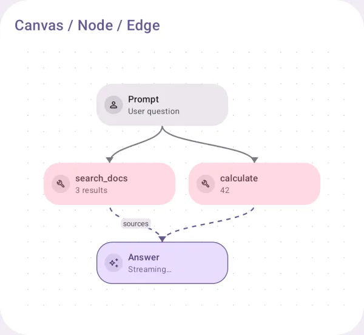

# Workflow

An agent run as a graph.

## Canvas / Node / Edge

An agent run as a graph: nodes, edges, labels, pan and zoom.

{ loading=lazy width="400" }

| | |
|---|---|
| API | `WorkflowCanvas(nodes, edges), agentRunGraph(message)` |
| AI Elements | `Canvas, Node, Edge, Controls, Panel, Toolbar` |
