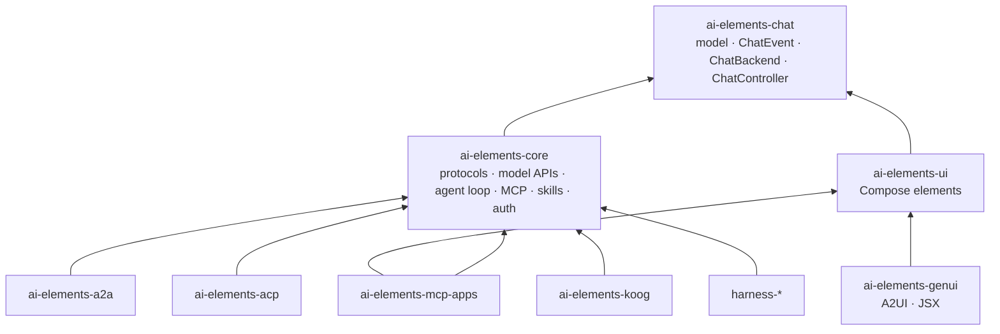
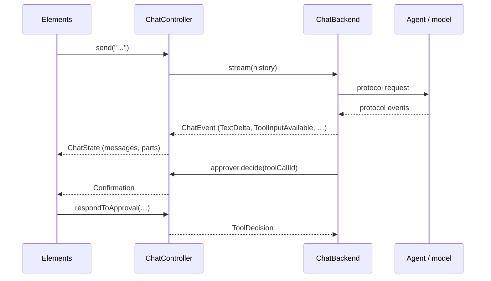

# Architecture

## Artifacts

- **`ai-elements-chat`** is the protocol-independent layer: the chat model (≈ AI SDK `UIMessage`),
  `ChatEvent`, `ChatBackend` and `ChatController` (≈ `useChat`). No networking, no Compose.
- **`ai-elements-core`** holds the protocol clients (AI SDK, AG-UI), model APIs, the agent loop,
  sub-agents, skills, MCP and OAuth. Each is a `ChatBackend` or a capability.
- **`ai-elements-ui`** holds the Compose elements. It depends on `ai-elements-chat` only, so it
  renders any backend, including one you write.
- **Optional artifacts** bring heavier dependencies or other runtimes: A2A (official Java SDK), ACP
  (official Kotlin SDK), Koog, the in-app harness capabilities, generative UI and MCP Apps.

A new protocol is a `ChatBackend` in `core` or in its own artifact. It never needs a UI change.

## Data flow

`ChatController` folds the events into messages (`MessageReducer`), publishes `ChatState`, queues
messages sent while a turn runs, keeps branches (regenerated answers) and checkpoints, and implements
the `ToolApprover` the backend asks.

## UI elements are protocol-independent

Elements render the in-process model only. They never import protocol, provider, agent or MCP code,
and never interpret tool names or protocol conventions. What a part means is a model field set
upstream: `ToolPart.kind` (`Function`, `Delegation`, `Skill`) and `ToolPart.source` are declared by
on-device tools or mapped from a protocol in `core`; shared agent state is `DataPart.STATE`. A unit
test (`LayeringTest`) enforces this.

## Packages in ai-elements-core

`chat` (controller, events, reducer) · `model` · `protocol.aisdk` / `protocol.agui` · `provider.*`
(model APIs) · `http` (internal transport helpers) · `agent` (tools, capabilities, loop,
sub-agents) · `mcp` · `skills` · `auth` · `config`. Dependencies point downwards: `protocol` and
`provider` use `chat`, `agent`, `http` and `model`, never the reverse.
