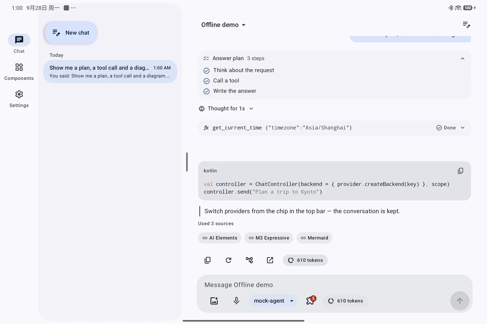
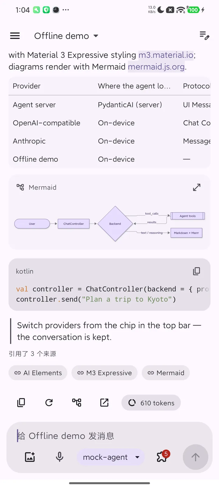
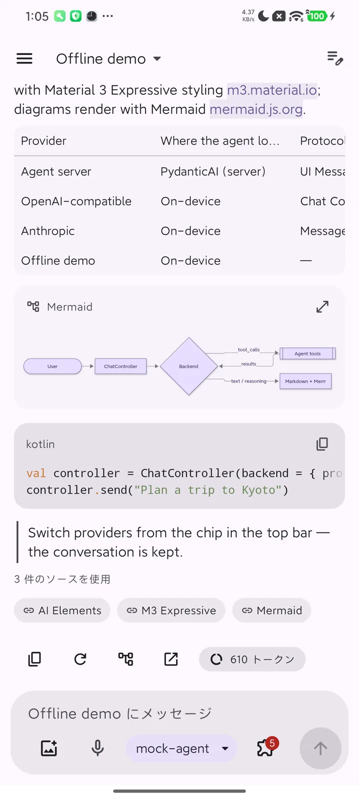

# Elements

The elements are Compose counterparts of [Vercel AI Elements](https://elements.ai-sdk.dev): every one
of its 49 components has one. The demo app's **Components** screen shows each.

Where the names differ:

| AI Elements | Here |
|---|---|
| `Canvas`, `Node`, `Edge`, `Connection`, `Controls`, `Panel`, `Toolbar` | `WorkflowCanvas` (custom nodes, toolbar and panel slots) |
| `Image` | `FileImage` (and `FileAttachment` in messages) |
| `Attachments` | `FileAttachment`, `AttachmentStrip` |
| `Context` | `ContextUsage` |
| `Suggestion` | `Suggestions` |
| `Shimmer` | `ShimmerText` |
| `JSXPreview` | `JsxPreview` in `ai-elements-genui` |
| `Question` | `Question`, and the choice lists of `InputRequestCard` when an agent asks |

| Group (package) | Elements |
|---|---|
| Chat (`ui.chat`) | `Chat` · `Conversation` · `MessageItem` · `PromptInput` · `Suggestions` · `Reasoning` · `ToolCall` + `Confirmation` · `InputRequestCard` · `Subagent` · `Sources` · `InlineCitation` · `ContextUsage` · `BranchSelector` · `Checkpoint` · `Queue` · `OpenInChat` · `ModelSelector` · `Question` · `Agent` |
| Agent structure (`ui.chat`) | `ChainOfThought` · `Plan` · `Task` · `DataPartView` |
| Workflow (`ui.workflow`) | `WorkflowCanvas` · `agentRunGraph` |
| Content (`ui.markdown`) | `MarkdownContent` · `CodeBlock` · `MermaidDiagram` · `MathBlock` · attachments |
| Voice (`ui.voice`) | `VoiceMode` · `Persona` · `SpeechInput` · read aloud (`SpeechOutputState`) · `AudioPlayer` · `Transcription` · `MicSelector` · `VoiceSelector` |
| Vibe coding (`ui.code`) | `Artifact` · `WebPreview` · `Terminal` · `StackTrace` · `TestResults` · `FileTree` · `Commit` · `SchemaDisplay` · `PackageInfo` · `EnvironmentVariables` · `Sandbox` · `Snippet` |

## Conversation

`Chat` is the whole screen: `Conversation` (the message list) and `PromptInput`, wired to a
`ChatController`. Use the parts directly when you need your own layout; see
[Quick start: pure client](../getting-started/pure-client.md#in-a-viewmodel).

`Conversation` renders each message part with the matching element:

| Part | Element |
|---|---|
| `TextPart` | `MarkdownContent`: GitHub-flavoured Markdown, code with highlighting, Mermaid, KaTeX |
| `ReasoningPart` | `Reasoning`: one quiet line ("Thought for 2s") that expands |
| `ToolPart` | `ToolCall`, `Subagent` for delegations, a skill badge for skill loads, `Confirmation` while it waits for approval |
| `SourcePart` | `Sources`, and `InlineCitation` for `[n]` markers |
| `FilePart` | images (upright by EXIF; tap for `ImageViewer`: zoom, pan, rotate), videos (`VideoAttachment`: first frame, duration, full-screen player), audio (`AudioPlayer`) and documents (`DocumentAttachment`: PDF preview and viewer; other formats open in an app) |
| `DataPart` | `Plan`, `Task`, A2UI surfaces, MCP Apps views, or your own renderer |

Long conversations stay at the bottom while they stream, unless the user scrolls up.

## Voice

- **Read aloud.** Every reply has a read-aloud action (platform text-to-speech; code, diagrams and
  math are skipped). `Conversation` creates the engine; provide `LocalSpeechOutput` to share one.
- **Dictation.** `SpeechInput` in the composer; with `onCancel` it shows the input level with
  cancel and done while listening.
- **Voice mode.** With nothing typed, the send button of `Chat` (or `PromptInput(onVoiceMode = …)`)
  opens `VoiceMode`: a hands-free conversation over the same `ChatController`. It listens, sends what
  the user said, reads the reply sentence by sentence while it streams, and listens again. Tap the
  persona to interrupt; mute or end at any time. When the agent asks for approval or an answer it
  pauses and offers to go back to the chat.

The engines are the device's: `LocalSpeechSettings` picks the recognition service (or on-device
recognition), the text-to-speech engine, voice and rate; `recognitionServices()` and
`SpeechOutputState.engines` / `voices` list the choices for a settings screen.

Voice uses the platform speech engines (`SpeechRecognizer`, `TextToSpeech`) and works with every
backend; no protocol is involved. `ai-elements-ui` declares the package-visibility `<queries>` for
both services; the app declares `RECORD_AUDIO`. Voice features hide themselves on devices without a
speech recognizer.

## Documents

Mobile best practice for artifacts such as reports and slides:

- **PDF** renders in the app with the platform `PdfRenderer`: the first page and page count in the
  message, every page in `PdfViewerDialog`. For text selection and search, Jetpack's `androidx.pdf`
  viewer (Android 9+) is the upgrade path.
- **Word, Excel, PowerPoint** have no platform renderer. They open in an app the user has (WPS,
  Microsoft Office, Google Docs, …) through `openExternally`, which shares the file with a
  `content:` URI from the library's own `FileProvider`. When the agent can produce a PDF rendition,
  send it too: it previews inline.
- Embedding an online viewer (for example Google's document viewer in a WebView) is not used: it
  sends the file's URL to a third party, needs a public URL and is unavailable in some regions.

## Layout

Elements adapt to the window: phones get a compact single column; tablets and foldables show the
conversation history as a list–detail pane in the demo.

{ loading=lazy }

## Theme

`AiElementsTheme` applies Material 3 Expressive with dynamic color by default. Pass your own
`colorScheme`, `typography` and `shapes` to use your brand; `AiSpacing` and `AiType` are the
elements' spacing and chat type scale. Icons are Material Symbols Rounded, generated as
`ImageVector`s (`AiIcons`), so the libraries add no icon dependency.

## Languages and accessibility

Strings ship in English, 简体中文, 繁體中文 and 日本語. Elements have content descriptions,
48 dp touch targets and TalkBack semantics.

{ loading=lazy width="240" }
{ loading=lazy width="240" }

