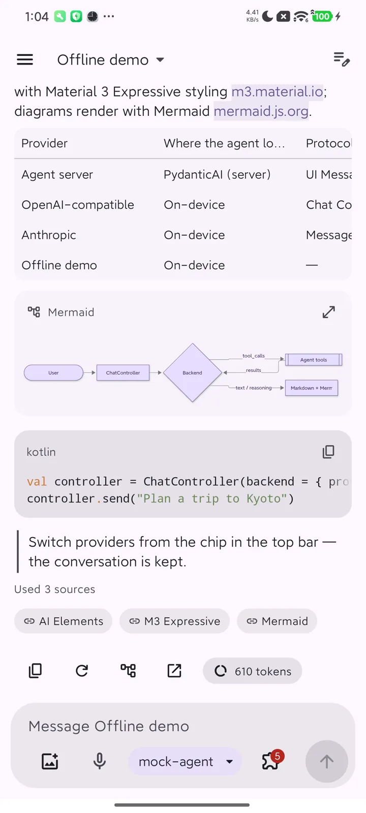
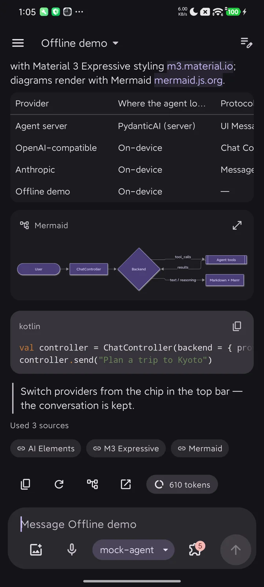
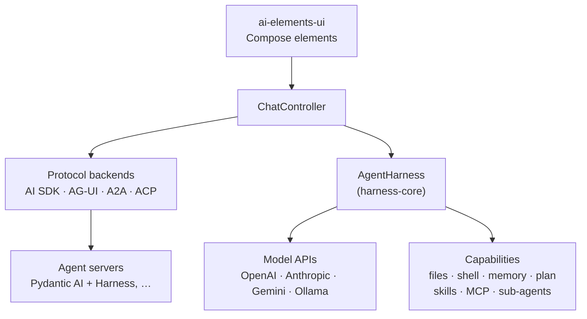

# AI Elements for Kotlin

**Material 3 Expressive** Jetpack Compose components and agent tooling for AI apps on Android: the
Compose counterpart of [Vercel AI Elements](https://elements.ai-sdk.dev). It connects only through
open protocols: AI SDK, AG-UI, MCP, MCP Apps, A2A, Agent Client Protocol, A2UI and Agent Skills.

<div class="grid" markdown>

{ loading=lazy width="280" }
{ loading=lazy width="280" }

</div>

```kotlin
--8<-- "demo/src/main/kotlin/dev/ai/elements/demo/samples/DocsSamples.kt:minimal"
```

That is a complete chat. It streams Markdown, reasoning, tool calls with approvals, sub-agents,
plans and sources from an AG-UI agent. Swap the backend to talk to any other protocol; the UI stays
the same.

## Two ways to use it

| Mode | Where the agent runs | You add |
|---|---|---|
| **Pure client**, like the ChatGPT or Claude apps | On your server (Pydantic AI, LangGraph, Mastra, any AI SDK / AG-UI server), a remote A2A agent, or a coding agent over ACP | `ai-elements-ui` + a protocol backend |
| **In-app agent** | On the device, over any model API | `ai-elements-ui` + `harness-*` capabilities: files, a Linux sandbox, memory, planning, a browser, device tools, speech, scheduled tasks, sub-agents, skills, MCP |



## Highlights

- **Complete element set.** Conversation, messages, reasoning, tools with approval, sub-agents,
  sources and citations, branches, checkpoints, queue, plan / task / chain of thought, artifacts,
  web preview, workflow canvas, voice, and developer tools (terminal, stack trace, tests, files).
  See [Elements](guides/elements.md).
- **Rich answers.** GitHub-flavoured Markdown, syntax highlighting, **Mermaid** and **KaTeX**, bundled
  and offline.
- **Open protocols** at their current revisions, with documented fallbacks for older peers.
  See [Protocols](protocols/index.md).
- **Human in the loop** across protocols. Approve, deny with a reason, edit arguments, or answer the
  forms agents ask for, whatever the protocol can carry. See
  [Human in the loop](guides/human-in-the-loop.md).
- **Generative UI.** A2UI v1.0 surfaces rendered natively, and interactive MCP Apps views in a
  sandbox. See [Generative UI](guides/generative-ui.md).
- **In-app harness** with the Pydantic AI Harness contracts: the same tool names and behaviour as
  the server library, so on-device and server agents render identically. It includes an
  **Alpine Linux sandbox** where the agent can `apk add python3` and run code. See
  [In-app agent](guides/harness.md).
- **Adaptive and accessible.** Phones, foldables and tablets; dark mode, dynamic color, palettes and
  contrast levels, fonts and text size, TalkBack; English, 简体中文, 繁體中文, 日本語.

## Next steps

- [Install](getting-started/installation.md) the artifacts you need.
- Build a [pure client](getting-started/pure-client.md) for your agent server, or an
  [in-app agent](getting-started/in-app-agent.md).
- Run the [reference server](develop/reference-server.md) and the [demo app](develop/demo-app.md)
  to see every flow end to end.
