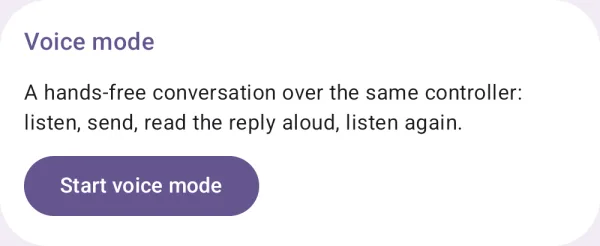
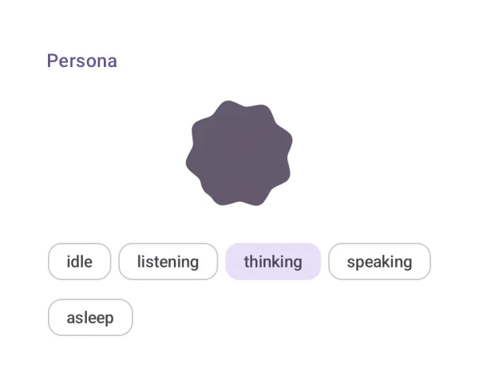
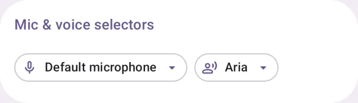

# 语音交互

语音对话、状态形象、语音输入和设备选择。

## 语音对话模式 { #voice-mode }

通过同一个 controller 完成免手持语音对话。

{ loading=lazy width="400" }

| | |
|---|---|
| API | `VoiceMode(controller, onClose)` |
| 依赖模块 | `ai-elements-ui` |
| API 文档 | [VoiceMode](/ai-elements-kotlin/api/ai-elements-ui/dev.ai.elements.ui.voice/-voice-mode.html) |

声明 RECORD_AUDIO 并完成权限流程，需要可用的识别与 TTS 服务。onClose 应关闭外层对话框或页面。

```kotlin
import androidx.compose.runtime.Composable
import dev.ai.elements.core.chat.ChatController
import dev.ai.elements.ui.voice.VoiceMode
```

```kotlin
--8<-- "demo/src/main/kotlin/dev/ai/elements/demo/samples/DocsSamples.kt:component-voice-mode"
```

## 语音状态形象 { #persona }

展示待机、倾听、思考与说话状态。

{ loading=lazy width="400" }

| | |
|---|---|
| API | `Persona(state, size, level)` |
| AI Elements | `Persona` |
| 依赖模块 | `ai-elements-ui` |
| API 文档 | [Persona](/ai-elements-kotlin/api/ai-elements-ui/dev.ai.elements.ui.voice/-persona.html) |

只负责视觉状态，不会录音或朗读。倾听和说话时可把音量传入 level。

```kotlin
import androidx.compose.runtime.Composable
import dev.ai.elements.ui.voice.Persona
import dev.ai.elements.ui.voice.PersonaState
```

```kotlin
--8<-- "demo/src/main/kotlin/dev/ai/elements/demo/samples/DocsSamples.kt:component-persona"
```

## 语音输入 { #speech-input }

使用平台语音识别把讲话转为输入文本。

{ loading=lazy width="400" }

| | |
|---|---|
| API | `SpeechInput(onTranscript, state)` |
| AI Elements | `SpeechInput` |
| 依赖模块 | `ai-elements-ui` |
| API 文档 | [SpeechInput](/ai-elements-kotlin/api/ai-elements-ui/dev.ai.elements.ui.voice/-speech-input.html) |

声明 RECORD_AUDIO。state 管理识别器生命周期；失败时展示 speech.error，并在 onTranscript 中区分中间结果与最终结果。

```kotlin
import androidx.compose.foundation.layout.Column
import androidx.compose.material3.Text
import androidx.compose.runtime.Composable
import androidx.compose.runtime.getValue
import androidx.compose.runtime.mutableStateOf
import androidx.compose.runtime.saveable.rememberSaveable
import androidx.compose.runtime.setValue
import dev.ai.elements.ui.voice.SpeechInput
import dev.ai.elements.ui.voice.rememberSpeechInputState
```

```kotlin
--8<-- "demo/src/main/kotlin/dev/ai/elements/demo/samples/DocsSamples.kt:component-speech-input"
```

## 麦克风与音色选择 { #mic-voice-selectors }

选择输入设备和朗读音色。

{ loading=lazy width="400" }

| | |
|---|---|
| API | `MicSelector(selected, onSelect), VoiceSelector(voices, selectedId, onSelect)` |
| AI Elements | `MicSelector, VoiceSelector` |
| 依赖模块 | `ai-elements-ui` |
| API 文档 | [MicSelector](/ai-elements-kotlin/api/ai-elements-ui/dev.ai.elements.ui.voice/-mic-selector.html) |

选择器只报告选项；请另行更新音频引擎或 SpeechSettings。可用设备与音色依赖当前系统。

```kotlin
import androidx.compose.foundation.layout.Column
import androidx.compose.runtime.Composable
import androidx.compose.runtime.getValue
import androidx.compose.runtime.mutableStateOf
import androidx.compose.runtime.remember
import androidx.compose.runtime.saveable.rememberSaveable
import androidx.compose.runtime.setValue
import dev.ai.elements.ui.voice.MicSelector
import dev.ai.elements.ui.voice.VoiceOption
import dev.ai.elements.ui.voice.VoiceSelector
```

```kotlin
--8<-- "demo/src/main/kotlin/dev/ai/elements/demo/samples/DocsSamples.kt:component-voice-selectors"
```

[Read this page in English](/ai-elements-kotlin/components/voice/)
