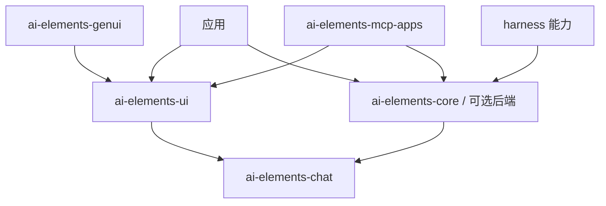

# 架构与分层

ai-elements-chat 定义消息、part、事件、backend 与 controller，不依赖网络或 Compose。
ai-elements-core 处理协议、模型 API、Agent 能力、MCP、认证等。UI 只依赖 chat，避免为了渲染单个组件拉入协议实现。
可选集成和各个 harness 模块按需添加，BOM 统一版本。

## 一轮对话

用户发送 → controller 记录消息 → backend 返回事件流 → reducer 更新消息快照 → Compose 渲染。
工具需要人工确认时，backend 等待 ToolApprover，controller 把请求放进状态，UI 回调再恢复等待者。

应用决定存储、凭据、系统权限与业务行为。库提供公开协议映射和界面机制，不强制应用使用某个服务端框架。
