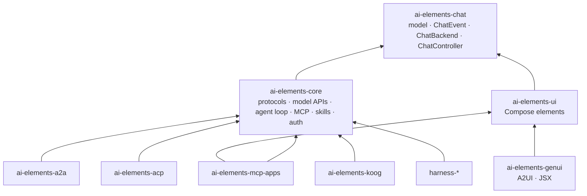
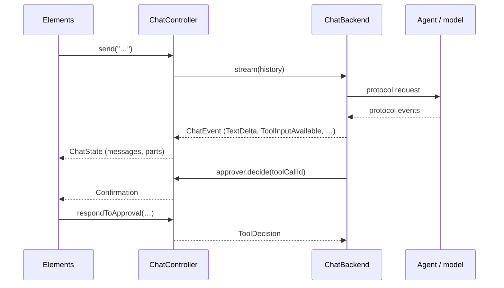

# 架构

## 模块依赖

- **`ai-elements-chat`**：与协议无关的聊天模型（类似 AI SDK `UIMessage`）、`ChatEvent`、`ChatBackend`、`ChatController`（类似 `useChat`）；无网络、无 Compose。
- **`ai-elements-core`**：协议客户端（AI SDK、AG-UI）、模型 API、Agent 循环、子 Agent、技能、MCP、OAuth；分别提供 `ChatBackend` 或能力。
- **`ai-elements-ui`**：Compose 组件，只依赖 chat，因此可渲染任意 backend，包括自定义实现。
- **可选模块**：提供更重的依赖或其他运行时，包括基于官方 Java SDK 的 A2A、官方 Kotlin SDK 的 ACP、Koog、应用内 harness 能力、生成式 UI、MCP Apps。

新增协议应在 core 或独立模块中实现 `ChatBackend`，无需修改 UI。

## 数据流

`ChatController` 通过 `MessageReducer` 将事件归并为消息并发布 `ChatState`，排队处理运行中发送的消息，保存重新生成回复的分支及 checkpoint，同时实现 backend 所需的 `ToolApprover`。

## UI 与协议无关 { #ui-elements-are-protocol-independent }

组件只渲染进程内模型，不导入协议、provider、Agent 或 MCP 代码，也不解释工具名称和协议约定。Part 的含义由上游设置：设备端工具声明或 core 协议映射设置 `ToolPart.kind`（`Function`、`Delegation`、`Skill`）与 `ToolPart.source`；共享状态为 `DataPart.STATE`。`LayeringTest` 单元测试约束这一分层。

## core 包结构

`chat`（controller、event、reducer）、`model`、`protocol.aisdk` / `protocol.agui`、`provider.*`（模型 API）、`http`（内部传输辅助）、`agent`（工具、能力、循环、子 Agent）、`mcp`、`skills`、`auth`、`config`。依赖向下：protocol 和 provider 使用 chat、agent、http、model，不允许反向依赖。
