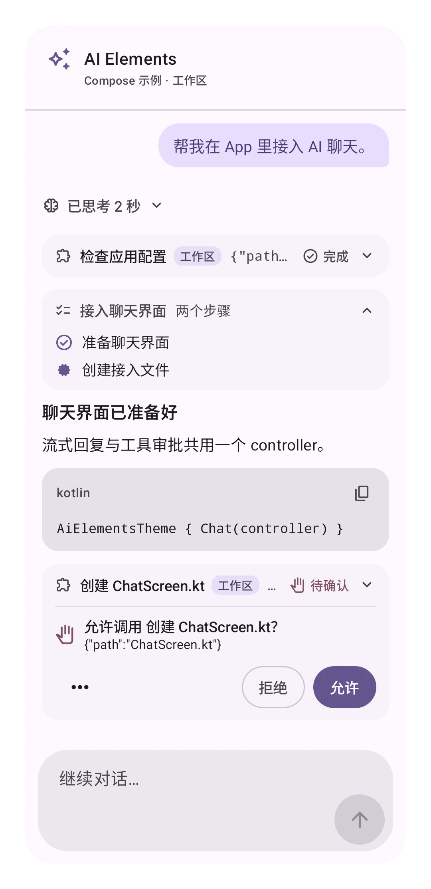
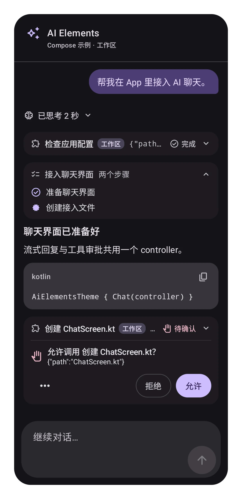
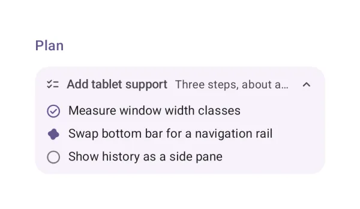
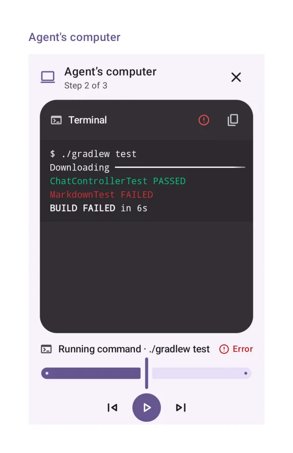

<div class="aie-hero" markdown>
<div markdown>

<p class="aie-eyebrow">Kotlin · Jetpack Compose · Material 3 Expressive</p>

# 把 AI 对话带进你的 App。

<p class="aie-lead">从一个聊天界面开始，也可以只选需要的组件。流式回复、工具审批、子 Agent 和生成式界面，连接你自己的 Agent 后端。</p>

[开始接入](getting-started/installation.md){ .md-button .md-button--primary }
[查看组件实图](components/index.md){ .md-button }

<div class="aie-facts"><span>65 个组件展示场景</span><span>Android · minSdk 24 / 26</span><span>Apache 2.0</span><span>中文 · English</span></div>

[English](/ai-elements-kotlin/) · [GitHub 源码](https://github.com/JuneLeGency/ai-elements-kotlin) · [API 参考（英文）](/ai-elements-kotlin/api/index.html)

</div>
<div class="aie-shots">


</div>
</div>

## 完整交互流程

<div class="aie-workflow" markdown>
<video controls muted loop playsinline preload="none" poster="../assets/workflows/agent-flow-zh-CN.webp" aria-label="完整交互流程">
<source src="../assets/workflows/agent-flow-zh-CN.mp4" type="video/mp4">
</video>
<div markdown>

输入 → 计划与推理 → 工具审批 → 设备端执行 → 流式回复。来自 Android 模拟器的真实录屏，使用确定性的离线演示 Agent；不需要模型密钥。

[播放 GIF 动画](../assets/workflows/agent-flow-zh-CN.gif)

</div>
</div>

## 从一个界面开始

```kotlin
--8<-- "demo/src/main/kotlin/dev/ai/elements/demo/samples/DocsSamples.kt:minimal"
```

`Chat` 把消息列表和输入框连接到 controller。正式 App 中建议由 ViewModel 持有 controller。
[纯客户端入门](getting-started/pure-client.md)包含依赖、权限、本地参考服务和完整接入步骤。

<div class="aie-cards" markdown>
<div class="aie-card" markdown>

### 连接已有 Agent

服务端运行 AI SDK、AG-UI、A2A 或 ACP Agent，App 负责展示消息、进度和人工审批。
你可以继续使用现有服务端运行时。

[构建纯客户端 →](getting-started/pure-client.md)

</div>
<div class="aie-card" markdown>

### 在 App 内运行 Agent

把模型 API 与文件、计划、记忆等可选能力组合起来。端侧 Agent 和服务端 Agent 共用聊天组件。

[构建端侧 Agent →](getting-started/in-app-agent.md)

</div>
</div>

## 看看组件的实际效果

<div class="aie-gallery" markdown>
<figure markdown>

[{ loading=lazy }](components/tools.md#tool-calls)
<figcaption>工具调用与审批</figcaption>
</figure>
<figure markdown>

[{ loading=lazy }](components/agent-structure.md#plan)
<figcaption>计划与任务进度</figcaption>
</figure>
<figure markdown>

[{ loading=lazy }](components/generative-ui.md#a2ui-surface)
<figcaption>生成式界面</figcaption>
</figure>
<figure markdown>

[{ loading=lazy }](components/developer-tools.md#terminal)
<figcaption>开发者工具</figcaption>
</figure>
<figure markdown>

[{ loading=lazy }](components/tools.md#agents-computer)
<figcaption>Agent 工作面板</figcaption>
</figure>
<figure markdown>

[{ loading=lazy }](components/attachments-and-media.md#image)
<figcaption>附件与媒体</figcaption>
</figure>
</div>

每项都提供真实截图、imports、经过编译的示例与 API 链接。[浏览全部 65 个场景 →](components/index.md)

## 保留你的后端与设计

- **按需组合界面：** 整页 `Chat`、消息列表与输入框，或单独使用一个组件。
- **自定义展示：** 主题、工具与数据 renderer、附件加载方式都可替换。
- **按需引入依赖：** UI 只依赖聊天模型；协议、Agent 能力和其他集成独立分包。
- **使用公开协议：** 支持 AI SDK、AG-UI、MCP/MCP Apps、A2A、ACP 和 A2UI。
- **明确升级预期：** 从首个公开版本起保留稳定 API；原生 Mermaid 需要显式实验性 opt-in。

[选择接入方式](getting-started/choose.md) · [自定义界面](guides/customizing.md) ·
[兼容性承诺](develop/api-compatibility.md) · [常见问题](getting-started/faq.md)
